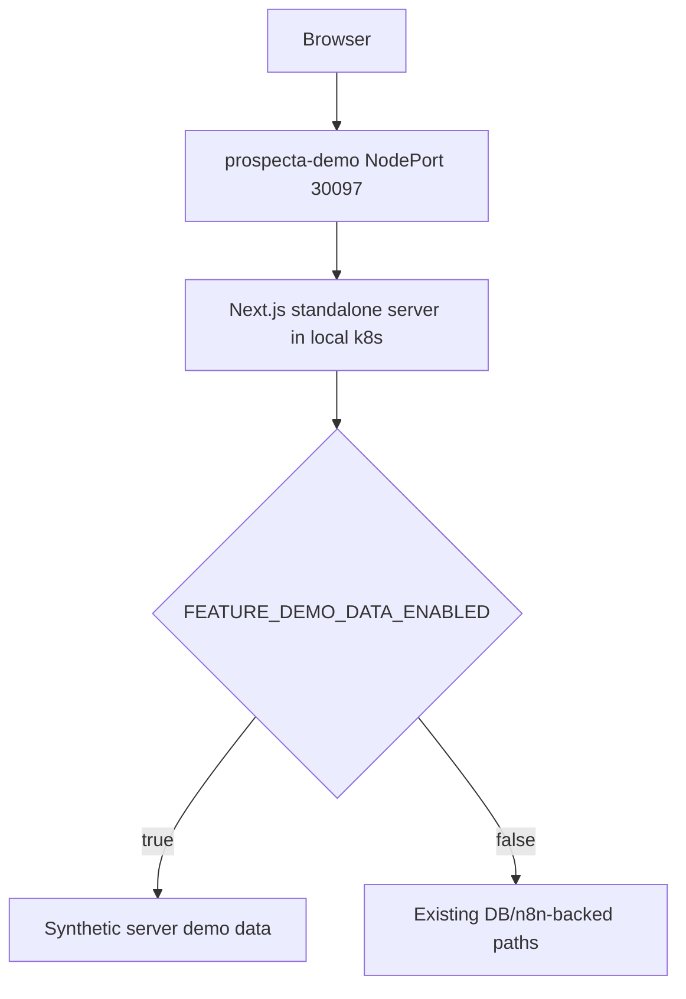

# Prospecta Kubernetes Demo Design

**Spec**: `.specs/features/prospecta-k8s-demo/spec.md`
**Status**: Approved for local demo

---

## Architecture Overview

Use the existing Next.js app and route contracts. Add one server-only feature
flag, `FEATURE_DEMO_DATA_ENABLED`, that switches selected read/upload routes to
synthetic data. The Kubernetes deployment runs a locally built image published
to the machine's Docker registry at `localhost:5000`.

---

## Code Reuse Analysis

| Component | Location | How to Use |
| --- | --- | --- |
| API envelopes | `src/server/api/errors.ts` | Keep `{ data, meta }` success shapes. |
| Lead DTO types | `src/types/leads.ts` | Reuse exact UI contracts for demo records. |
| Import DTO types | `src/types/imports.ts` | Reuse batch summary contract for demo batches. |
| Upload validation | `src/server/imports/upload-file.ts` | Validate demo uploads before synthetic acknowledgement. |
| Demo auth bypass | `src/server/auth/authorization.ts` | Reuse with explicit demo flag for the local presentation. |

---

## Components

### Demo Data Module

- **Purpose**: Provide synthetic leads, history, batches, details, and upload
  acknowledgements without database or n8n calls.
- **Location**: `src/server/demo/`
- **Interfaces**:
  - `listDemoLeads(query): LeadListResult`
  - `getDemoLeadDetail(cnpj, leadRunId?): LeadDetail | null`
  - `listDemoLeadHistory(cnpj, query): LeadHistoryResult`
  - `listDemoImportBatches(query): ListImportBatchesResult`
  - `getDemoImportBatchDetail(id): GetImportBatchDetailResult`
  - `submitDemoImport(input): SubmitImportResult`
- **Dependencies**: Existing domain types and upload validation.

### Route Switches

- **Purpose**: Keep auth and feature checks, then branch to demo data only when
  the demo flag is explicitly true.
- **Location**: `src/app/api/**/route.ts`
- **Dependencies**: `getServerEnv()`.

### Kubernetes Demo Manifest

- **Purpose**: Deploy the local working tree to the machine's cluster without a
  production registry or privileged containerd image import.
- **Location**: `k8s/prospecta-demo.yaml`
- **Dependencies**: local Docker registry `localhost:5000`, placeholders in
  ConfigMap/Secret.

---

## Error Handling Strategy

| Error Scenario | Handling | User Impact |
| --- | --- | --- |
| Demo flag off | Existing code path | No behavior change. |
| Invalid CSV in demo | Existing upload validation | Business-safe validation message. |
| Unknown synthetic lead/batch | Existing 404 envelope | Not-found UI state. |
| Pod cannot install dependencies | Kubernetes pod remains not ready | Operator checks pod logs. |

---

## Tech Decisions

| Decision | Choice | Rationale |
| --- | --- | --- |
| Local auth | Existing dev bypass in `NODE_ENV=development` | Avoids adding a production bypass. |
| Image strategy | Build/push `localhost:5000/prospecta/app:demo` | The local cluster successfully pulled from `localhost:5000`, avoiding hostPath runtime startup cost. |
| Demo data | Explicit feature flag | Keeps synthetic presentation separate from real contracts. |
