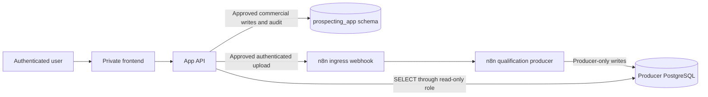

# Prospecta Design

**Spec:** `.specs/features/prospecting-console/spec.md`  
**Context:** `.specs/features/prospecting-console/context.md`  
**Status:** APPROVED FOR STAGED IMPLEMENTATION

## Current State

The implemented application is a private, GET-only lead browser using one
server-side PostgreSQL connection. The current producer workflow is initiated
by an n8n form, creates its batch identity internally, and writes legacy
producer tables. No approved app-to-n8n ingress or app-owned write schema
exists.

## Target Architecture

This architecture is authorized for repository and synthetic/local
implementation. Each external edge remains disabled until its target,
credential, owner, and contract evidence are identified. Production activation
is a separate approval.

## Trust Boundaries

| Boundary | Required control |
| --- | --- |
| Browser → App API | OIDC session, CSRF protections appropriate to route, permission checks, validation |
| App API → n8n ingress | HTTPS, HMAC with timestamp, replay window, size/rate limits, server-only secret |
| App API → producer database | Separate role with `SELECT` only on allowlisted sources |
| App API → app schema | Separate role with minimum CRUD privileges and transaction-scoped audit |
| Producer → producer database | Owned and operated outside this app |

## Code Reuse Analysis

| Existing asset | Location | Proposed reuse |
| --- | --- | --- |
| OIDC claim validation | `src/server/auth/authorization.ts` | Extend the server context with verified actor and permissions |
| API authorization guard | `src/server/auth/require-api-session.ts` | Preserve auth-first behavior; return actor-aware context |
| Safe API envelopes | `src/server/api/errors.ts` | Extend with import/conflict/rate/source error codes |
| Server-only PostgreSQL client | `src/server/db/client.ts` | Split into producer-read and app-write pools |
| Lead repositories/mappers | `src/server/repositories/`, `src/server/mappers/` | Keep producer read model isolated from commercial state |
| Lead UI and formatters | `src/components/leads/`, `src/lib/formatters/` | Reuse current business presentation and Brazilian formatting |
| Validators | `src/lib/validators/` | Apply route-level validation patterns |

## Proposed Components

These are contractual component boundaries, not implementation tasks.

### Actor-aware authorization

- **Purpose:** return verified actor, organization, and permissions to private
  pages and API handlers.
- **Proposed location:** `src/server/auth/`.
- **Key rule:** permission failure occurs before database, file, or n8n work.

### Producer read connection

- **Purpose:** query only approved producer views/tables.
- **Proposed location:** `src/server/db/producer-client.ts`.
- **Credential:** `PRODUCER_DATABASE_URL`.
- **Key rule:** the role cannot `INSERT`, `UPDATE`, `DELETE`, execute mutation
  functions, or access unapproved sensitive sources.

### App-owned data connection

- **Purpose:** transact commercial state and append-only audit events.
- **Proposed location:** `src/server/db/app-client.ts`.
- **Credential:** `APP_DATABASE_URL`.
- **Key rule:** it cannot mutate producer objects.

### Import submission service

- **Purpose:** validate superficial file properties, record submission intent,
  calculate the byte hash, call approved ingress, and persist acceptance.
- **Proposed location:** `src/server/imports/`.
- **Key rule:** it never parses business rows or reproduces n8n semantics.

### Batch read model

- **Purpose:** merge app submission/acceptance facts with approved producer
  observations.
- **Proposed location:** `src/server/repositories/imports/`.
- **Key rule:** all counts and states include provenance; unavailable values
  remain `null`.

### Commercial workspace service

- **Purpose:** manage assignment, stage, next action, activity, and notes in the
  app schema.
- **Proposed location:** `src/server/commercial/`.
- **Key rule:** every change and conflict is transactionally audited.

## Data Ownership

| Data | Owner | App access |
| --- | --- | --- |
| Qualification score, verdict, action, priority, trust | n8n producer | Read only |
| Producer runs and reports | n8n producer | Read only, allowlisted |
| Upload submission and acceptance metadata | Prospecta | Controlled read/write |
| Commercial assignment, stage, follow-up, notes | Prospecta | Controlled read/write |
| Audit events for app-owned writes | Prospecta | Append only |
| Raw CSV bytes | Transient mechanism | No permanent PostgreSQL storage |

## API Direction

Proposed future endpoints:

| Endpoint | Purpose | Permission |
| --- | --- | --- |
| `POST /api/imports` | Submit one approved CSV | `imports:create` |
| `GET /api/imports` | Paginated batch list | `imports:read` |
| `GET /api/imports/:id` | Batch facts and correlated observations | `imports:read` |
| `GET /api/work-queue` | Paginated commercial queue | `commercial:read` |
| `PATCH /api/workspaces/:id` | Assignment/stage/next action | `commercial:write` |
| `POST /api/workspaces/:id/activities` | Append commercial activity | `commercial:write` |
| `POST /api/workspaces/:id/notes` | Append note | `commercial:write` |

All producer lead endpoints remain GET-only.

## Error Strategy

| Scenario | API behavior | Business presentation |
| --- | --- | --- |
| Missing or invalid session | `401` safe envelope | Login required |
| Missing permission | `403` safe envelope | Access denied |
| Invalid file metadata | `400` safe field errors | Correct the selected file |
| Idempotency key/hash conflict | `409` safe envelope | Submission conflicts with an earlier file |
| File too large | `413` safe envelope | File exceeds approved limit |
| Rate limited | `429` safe envelope | Try again later; no automatic retry |
| Producer unavailable before acceptance | `503` safe envelope | Submission not confirmed |
| Producer data unavailable after acceptance | `503` or nullable observation | Acceptance retained; processing unavailable |
| Optimistic commercial conflict | `409` safe envelope | Refresh before changing ownership/state |

## Non-obvious Decisions

| Decision | Choice | Rationale |
| --- | --- | --- |
| Producer versus app persistence | Separate roles and ownership | Database privileges enforce the system boundary |
| Batch identifier | Producer-issued opaque value | The app cannot derive producer identity safely |
| Import response | `202 Accepted` | Acceptance and expensive processing are different facts |
| CSV validation | Superficial only | Prevents duplicate qualification logic |
| Browser upload body | Raw CSV bytes plus sanitized metadata headers | Avoids browser-to-n8n access and preserves exact bytes |
| Upload envelope | 10 MiB maximum; UTF-8; `.csv`; approved content type | Bounded implementation default, subject to operational production review |
| Commercial history | Append-only events plus current workspace | Supports audit and efficient queue reads |
| Producer status | Evidence-based nullable read model | Prevents false success/failure claims |
| Feature release | Server-side flags per capability | Allows gradual rollout and independent rollback |

## External Activation Conditions

- Producer owners deploy and prove the separate ingress and batch terminal
  semantics in a named non-production environment.
- Database owners approve targets, roles, grants, migration, backup, and
  rollback.
- Identity owners approve claim names, role assignments, and revocation.
- Data-policy owners approve production field, host, retention, and contact
  allowlists.
- Query performance evidence is recorded.
- Security/UAT pass before rollout.
- Production activation receives separate explicit approval.
