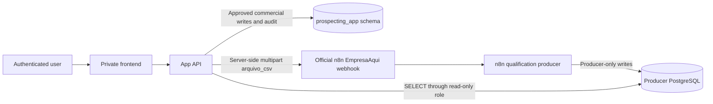

# Prospecta Design

**Spec:** `.specs/features/prospecting-console/spec.md`  
**Context:** `.specs/features/prospecting-console/context.md`  
**Status:** APPROVED FOR STAGED IMPLEMENTATION

## Current State

The implemented application is a private, GET-only lead browser using one
server-side PostgreSQL connection. The official current EmpresaAqui ingress is
`EmpresaAqui - Webhook Import v1 - StrictOneTokenDomainGate`, defined by
`private-workflows/EmpresaAqui_Webhook_Import_v1.json`. It receives a CSV by
webhook, creates `import_batch_id` internally, returns a controlled `202`, and
writes existing producer objects.

The App API does not yet integrate with that webhook, and no app-owned write
schema exists. Static workflow mapping does not establish a secured,
non-production endpoint or production readiness.

## Target Architecture

This architecture is authorized for repository and synthetic/local
implementation. Each external edge remains disabled until its target,
credential, owner, and contract evidence are identified. Production activation
is a separate approval.

The App API, and only the App API, will call the official n8n webhook
server-side. The frontend always calls Prospecta routes and never calls,
receives, logs, or embeds the n8n URL.

## Trust Boundaries

| Boundary | Required control |
| --- | --- |
| Browser → App API | Current: OIDC session plus exact issuer/organization authorization; CSRF protections and validation. Granular permissions remain externally gated |
| App API → official n8n webhook | Current shape is `POST` multipart `arquivo_csv`; HTTPS, authentication/HMAC, replay, idempotency, size/rate limits, and tested errors remain required gaps |
| App API → producer database | Separate role with `SELECT` only on allowlisted sources |
| App API → app schema | Separate role with minimum CRUD privileges and transaction-scoped audit |
| Producer → producer database | Owned and operated outside this app |

## Code Reuse Analysis

| Existing asset | Location | Proposed reuse |
| --- | --- | --- |
| OIDC claim validation | `src/server/auth/authorization.ts` | Retain verified issuer/subject/organization; keep permissions empty until the external authorization gate |
| API authorization guard | `src/server/auth/require-api-session.ts` | Preserve auth-first behavior; return actor-aware context |
| Safe API envelopes | `src/server/api/errors.ts` | Extend with import/conflict/rate/source error codes |
| Server-only PostgreSQL client | `src/server/db/client.ts` | Split into producer-read and app-write pools |
| Lead repositories/mappers | `src/server/repositories/`, `src/server/mappers/` | Keep producer read model isolated from commercial state |
| Lead UI and formatters | `src/components/leads/`, `src/lib/formatters/` | Reuse current business presentation and Brazilian formatting |
| Validators | `src/lib/validators/` | Apply route-level validation patterns |

## Proposed Components

These are contractual component boundaries, not implementation tasks.

### Actor-aware authorization

- **Purpose:** return the verified actor and organization to private pages and
  API handlers. The permission slot remains empty in this phase.
- **Proposed location:** `src/server/auth/`.
- **Key rule:** missing/expired sessions and invalid issuer/organization fail
  before database, file, or n8n work. Future permission checks must preserve
  that ordering.
- **Current role boundary:** no provider role claim is requested or mapped;
  `AUTH_ROLE_CLAIM` and `AUTH_ROLE_MAPPING` are deferred.

### Producer read connection

- **Purpose:** query only approved producer views/tables.
- **Proposed location:** `src/server/db/producer-client.ts`.
- **Credential:** `PRODUCER_DATABASE_URL`.
- **Key rule:** the role cannot `INSERT`, `UPDATE`, `DELETE`, execute mutation
  functions, or access unapproved sensitive sources.

### App-owned data connection

- **Purpose:** transact commercial state and append-only audit events.
- **Proposed location:** `src/server/db/app-client.ts`.
- **Credential:** `APP_DATABASE_URL`.
- **Key rule:** it cannot mutate producer objects.

### Import submission service

- **Purpose:** validate superficial file properties, record submission intent,
  calculate the byte hash, call the official webhook server-side, validate its
  actual response, and persist only facts that the contract proves.
- **Proposed location:** `src/server/imports/`.
- **Key rule:** it never parses business rows or reproduces n8n semantics.
- **Activation gate:** do not implement the client or route until T018/T019
  prove a secured non-production contract and resolve acknowledgement versus
  durable acceptance.

### Official n8n integration configuration

- **Webhook URL:** server-only environment variable containing the complete
  test or production n8n URL for the configured `empresaqui/import` path.
- **Current required setting:** `N8N_IMPORT_URL` only; it does not authorize a
  call while the import feature is disabled.
- **Deferred authentication settings:** `N8N_HMAC_KEY_ID` and
  `N8N_HMAC_SECRET` may remain optional and server-only, but are unused because
  the official workflow does not validate HMAC.
- **Exposure rule:** no n8n URL, key ID, secret, signature, or internal endpoint
  may use `NEXT_PUBLIC_*` or enter frontend bundles/responses.
- **Activation rule:** `FEATURE_IMPORTS_ENABLED` remains `false` until T019
  defines and proves the server-to-server authentication mechanism and the
  remaining ingress contract.
- **Current response:** HTTP `202` JSON with `accepted`, `message`,
  `import_batch_id`, `row_count`, and `source`.

### Batch read model

- **Purpose:** merge app submission, workflow acknowledgement, any separately
  proven durable acceptance, and approved producer observations.
- **Proposed location:** `src/server/repositories/imports/`.
- **Key rule:** all counts and states include provenance; unavailable values
  remain `null`.

### Commercial workspace service

- **Purpose:** manage assignment, stage, next action, activity, and notes in the
  app schema.
- **Proposed location:** `src/server/commercial/`.
- **Key rule:** every change and conflict is transactionally audited.

## Data Ownership

| Data | Owner | App access |
| --- | --- | --- |
| Qualification score, verdict, action, priority, trust | n8n producer | Read only |
| Producer runs and reports | n8n producer | Read only, allowlisted |
| Upload submission, acknowledgement, and nullable durable-acceptance metadata | Prospecta | Controlled read/write |
| Commercial assignment, stage, follow-up, notes | Prospecta | Controlled read/write |
| Audit events for app-owned writes | Prospecta | Append only |
| Raw CSV bytes | Transient mechanism | No permanent PostgreSQL storage |

## API Direction

Proposed future endpoints:

| Endpoint | Purpose | Permission |
| --- | --- | --- |
| `POST /api/imports` | Submit one approved CSV | `imports:create` |
| `GET /api/imports` | Paginated batch list | `imports:read` |
| `GET /api/imports/:id` | Batch facts and correlated observations | `imports:read` |
| `GET /api/work-queue` | Paginated commercial queue | `commercial:read` |
| `PATCH /api/workspaces/:id` | Assignment/stage/next action | `commercial:write` |
| `POST /api/workspaces/:id/activities` | Append commercial activity | `commercial:write` |
| `POST /api/workspaces/:id/notes` | Append note | `commercial:write` |

All producer lead endpoints remain GET-only.

## Error Strategy

This is the desired safe App API behavior. Producer status/error mappings
remain disabled until T019 proves them; the official export currently has no
controlled error branch.

| Scenario | API behavior | Business presentation |
| --- | --- | --- |
| Missing or invalid session | `401` safe envelope | Login required |
| Missing permission | `403` safe envelope | Access denied |
| Invalid file metadata | `400` safe field errors | Correct the selected file |
| Idempotency key/hash conflict | `409` safe envelope | Submission conflicts with an earlier file |
| File too large | `413` safe envelope | File exceeds approved limit |
| Rate limited | `429` safe envelope | Try again later; no automatic retry |
| Producer unavailable before acknowledgement | Safe mapped envelope after T019 | Submission recorded; producer outcome unknown |
| Producer data unavailable after acknowledgement | Safe envelope or nullable observation | Acknowledgement retained; durable acceptance/processing unavailable |
| Optimistic commercial conflict | `409` safe envelope | Refresh before changing ownership/state |

## Non-obvious Decisions

| Decision | Choice | Rationale |
| --- | --- | --- |
| Producer versus app persistence | Separate roles and ownership | Database privileges enforce the system boundary |
| Batch identifier | Returned producer `import_batch_id` | It is the real workflow correlation field and retains its established name |
| Import response | Controlled HTTP `202` acknowledgement | The current branch acknowledges extraction/normalization but does not prove durable acceptance |
| CSV validation | Superficial only | Prevents duplicate qualification logic |
| Browser upload body | Raw CSV bytes plus sanitized metadata headers | Avoids browser-to-n8n access and preserves exact bytes |
| App-to-n8n upload body | `multipart/form-data` field/binary `arquivo_csv` | Matches the official workflow; it reads no prior proposed metadata fields |
| Upload envelope | App-side 10 MiB/UTF-8/`.csv` baseline; producer limits unproven | Bounded app default still requires non-production compatibility evidence |
| Commercial history | Append-only events plus current workspace | Supports audit and efficient queue reads |
| Producer status | Evidence-based nullable read model | Prevents false success/failure claims |
| Feature release | Server-side flags per capability | Allows gradual rollout and independent rollback |

## External Activation Conditions

- Producer owners identify a named non-production endpoint and prove that its
  imported workflow/version matches
  `private-workflows/EmpresaAqui_Webhook_Import_v1.json`.
- Security and producer owners resolve and test the current authentication,
  replay, upload-idempotency, byte-integrity, durable-acceptance, controlled
  error, and timeout-reconciliation gaps before app client implementation.
- Producer owners prove batch terminal semantics in a named non-production
  environment; the current response does not prove completion.
- Database owners approve targets, roles, grants, migration, backup, and
  rollback.
- Identity/security owners approve the future granular-authorization source,
  permission assignments, organization binding, and revocation behavior.
- Data-policy owners approve production field, host, retention, and contact
  allowlists.
- Query performance evidence is recorded.
- Security/UAT pass before rollout.
- Production activation receives separate explicit approval.
