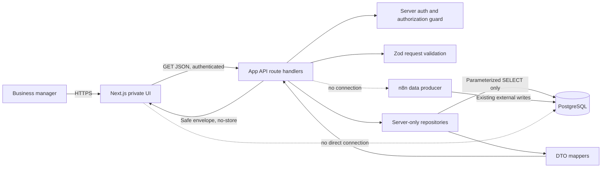

# Read-only Lead Browser Design

**Spec:** `.specs/features/read-only-lead-browser/spec.md`  
**Context:** `.specs/features/read-only-lead-browser/context.md`  
**Phase:** Design  
**Status:** Draft — not approved for implementation

## Architecture Overview

The application is a new Next.js App Router project with strict TypeScript. It is **a browser for eligible, readable, retained decisions**, not an authoritative inventory of every analysis ever produced. Authenticated browser pages call only authenticated GET route handlers. Route handlers validate input, invoke server-only repositories, map database rows into explicit DTOs, and return safe envelopes. PostgreSQL credentials and raw rows never cross the server boundary.

This design is an implementation framework, not current authorization to bootstrap. The evidence-gate outputs determine the eligible production predicate, readable-field contract, enabled query capability matrix, history caveat, report/evidence exposure, and whether batch/source views exist at all.



The diagram is source-only because `mermaid-studio` is not installed. It must be rendered/validated during plan approval or bootstrap.

## Technology Direction

Exact package versions are selected during bootstrap from current stable releases and locked in `pnpm-lock.yaml`; this plan does not invent versions.

| Concern | Planned choice | Constraint |
| --- | --- | --- |
| Framework | Next.js App Router, TypeScript strict | Pages under `src/app`; route handlers under `src/app/api` |
| Styling | Tailwind CSS; shadcn/ui only for selected primitives | No dashboard/chart dependency |
| Request validation | Zod | Validate before repository calls |
| Database | Minimal PostgreSQL driver with typed row interfaces | Server-only, parameterized `SELECT`, no ORM migration engine |
| Authentication | Established server-session library with approved OIDC provider | Provider/org rule pending approval |
| Tables | Server-driven table components; TanStack Table only if it reduces UI complexity | Only evidence-approved sorting/filtering/counts are exposed; pagination alone is not a query-safety control |
| Unit/component tests | Vitest plus React Testing Library | Synthetic data only |
| End-to-end tests | Deferred until auth test strategy is approved | Must never use production data |

## Code Reuse Analysis

This is a greenfield repository. There is no application code, package manifest, test harness, component library, or prior feature plan to reuse.

| Existing asset | How it is used |
| --- | --- |
| `AGENTS.md` | Binding project, security, layout, API, test, and scope conventions |
| `docs/db/schema.sql` | DDL evidence for read queries and DTO source mapping; never executed as a production migration |
| `docs/db/tables.txt`, `views.txt`, `functions.txt` | Present but empty; no design claims are based on them |
| Sanitized n8n docs | Not present; no n8n behavior is assumed |

## Data Access Design

### Latest eligible decision

After the contract and query gates approve the production predicate and capability matrix, the list query must follow this logical order:

1. Restrict to approved production `execution_mode` values.
2. Restrict to `cnpj_normalizado IS NOT NULL`.
3. Restrict current candidates to `decision_status = 'COMPLETED'`.
4. Rank by `cnpj_normalizado`, then `created_at DESC, decision_id DESC`.
5. Keep rank 1.
6. Apply only evidence-approved business filters to those latest rows.
7. Apply only evidence-approved allowlisted deterministic sorting and bounded pagination.
8. Run an exact matching count only if the reviewed count query is acceptable; otherwise use an approved bounded/alternative pagination contract that does not imply an exact total.

Applying filters before ranking is prohibited: it could select an older decision merely because that older row matches a filter.

The query reads `lead_decisions` directly. It may copy the ordering intent of `company_latest_validation`, but it must not inherit that view’s default-zero/default-empty JSON coercions.

### Detail selection

- Normalize and validate the CNPJ.
- With no `leadRunId`, use the same latest eligibility and ordering as the list.
- With `leadRunId`, require an exact CNPJ + run match within approved production modes.
- Return `404 LEAD_NOT_FOUND` for no eligible match; do not reveal whether an excluded/test run exists.
- Extract only allowlisted JSON paths and native columns needed by the DTO.

### History selection

- Query `lead_decisions` by exact normalized CNPJ and approved production modes.
- Include `COMPLETED` and `SUPERSEDED_MANUALLY` rows so superseded decisions remain auditable.
- Sort `created_at DESC, decision_id DESC`.
- Paginate and return the total.
- Never group or deduplicate by source hash, batch, input row, or CNPJ.
- If production-mode or retention evidence is not approved, disable the route and show unavailable history.
- Unless retention completeness is proven, metadata and UI copy describe “Histórico disponível” or “Análises retidas encontradas” and state that older analyses may not be present.
- Never label returned rows as a complete audit trail or every analysis ever produced.

### Strategic report selection

- Report/evidence retrieval is disabled until the semantic PII and confidential-content policy approves an allowlist plus redaction/omission behavior.
- Query `company_strategic_research_reports` only by exact selected `lead_run_id` and CNPJ.
- Ignore test rows unless an approved production predicate exists.
- Require `integrity_status = 'OK'` to render content.
- Zero matching rows means `missing`.
- One matching eligible row means `available`.
- More than one matching eligible row means `ambiguous`; do not silently attach content.
- An expired row may still be read but must be labeled `stale` from stored `expires_at`.
- Do not expose `raw_payload` or `integrity_error`.
- No CNPJ-only report fallback is permitted in MVP.
- XSS sanitization does not establish privacy safety. Content that is structurally valid but semantically uncertain is omitted or redacted according to policy.

### Optional batch/source selection

- Default to no batch/source route or screen.
- Enable it only if reviewers determine that the selected fields, labels, aggregates, and navigation cannot reasonably be mistaken for import progress or operational monitoring.
- Source `lead_import_batches` for identity and metadata.
- Left join aggregate counts from eligible `lead_decisions`:
  - `savedDecisionCount = count(decision_id)`
  - `analyzedCompanyCount = count(distinct cnpj_normalizado)`
- Do not calculate a completion percentage.
- Do not use `received_count` as row progress.
- Do not query legacy batch-flow views for confirmed business counts.

### Query safety

- All values use bound parameters.
- Sort keys map to hardcoded SQL fragments; client strings are never interpolated as SQL identifiers.
- Text search escapes `%`, `_`, and the chosen escape character.
- Repositories accept validated domain query objects rather than raw `URLSearchParams`.
- Connection acquisition, transactions, and query timeout remain server-only.
- The deployed role has `SELECT` on approved objects only and no create/write privileges.
- The application does not execute `docs/db/schema.sql`.

Pagination limits returned rows but does not bound the work required to rank, filter, sort, extract JSON, or count. Before implementation, an authorized production/production-like audit must establish a query capability matrix:

| Query concern | Required evidence | Default when unsupported |
| --- | --- | --- |
| Latest-per-CNPJ relation | Realistic plan with cardinality and representative version/mode predicate | Do not implement list query |
| Exact total | Separate count plan and measured impact | Omit exact total; use an approved non-exact navigation contract |
| JSON projection/extraction | Cost of all selected JSON paths under realistic rows and payload sizes | Remove or defer expensive fields |
| Filters | Index/predicate compatibility for selective and unselective values | Omit filter |
| Text search | Escaping plus realistic company/CNPJ search plan | Restrict to exact/prefix CNPJ or defer broad name search |
| Sorting | Plan and memory/disk-sort behavior for each allowlisted key | Keep only safe default/approved sorts |
| Date ranges | Representative narrow and broad range plans | Bound range or omit filter |
| Concurrency | Expected sessions, pool limits, statement timeout, and production headroom | Reduce capability/concurrency or defer |

The review records sanitized plans/metrics only. It does not commit SQL parameters containing business data, raw rows, payloads, reports, or evidence.

## Read-only DTOs

API DTO dates are ISO-8601 UTC strings. UI formatters convert them to `dd/MM/yyyy` in `America/Sao_Paulo`. Nullable fields are present with `null`; they are not omitted or replaced with zero.

```ts
type Nullable<T> = T | null

interface LeadSummary {
  cnpj: string
  companyName: Nullable<string>
  city: Nullable<string>
  uf: Nullable<string>
  sector: Nullable<string>
  score: Nullable<number>
  priority: Nullable<string>
  recommendedAction: Nullable<string>
  trustStatus: Nullable<string>
  confidenceIndicator: "normal" | "low" | "unknown"
  lastAnalysisAt: string
  decisionId: string
  leadRunId: string
  importBatchId: string
  sourceRow: number
}

interface LeadDetail extends LeadSummary {
  legalName: Nullable<string>
  tradeName: Nullable<string>
  primaryCnae: Nullable<string>
  primaryCnaeDescription: Nullable<string>
  companySize: Nullable<string>
  taxRegime: Nullable<string>
  estimatedRevenue: Nullable<string>
  employeeCount: Nullable<string>
  branchCount: Nullable<number>
  preTrustScore: Nullable<number>
  preTrustStatus: Nullable<string>
  finalVerdict: Nullable<string>
  recommendedActionReason: Nullable<string>
  agentSummary: Nullable<string>
  icpScore: Nullable<number>
  strategicAssetScore: Nullable<number>
  riskFlags: Nullable<LeadRisk[]>
  positiveSignals: Nullable<LeadSignal[]>
  evidences: Nullable<LeadEvidence[]>
  strategicReport: StrategicReport
  contactSnapshot: Nullable<ContactSnapshot>
  audit: LeadAudit
  dataQuality: DataQualityNotice[]
}

interface LeadHistoryItem {
  decisionId: string
  leadRunId: string
  importBatchId: string
  sourceRow: number
  analyzedAt: string
  score: Nullable<number>
  finalVerdict: Nullable<string>
  recommendedAction: Nullable<string>
  recommendedActionReason: Nullable<string>
  priority: Nullable<string>
  trustStatus: Nullable<string>
  agentVersion: string
  sourceHash: string
  usedCache: boolean
  decisionStatus: "COMPLETED" | "SUPERSEDED_MANUALLY"
  supersededAt: Nullable<string>
  supersededByDecisionId: Nullable<string>
  isCurrent: boolean
}

interface BatchSourceSummary {
  importBatchId: string
  sourceSystem: string
  originalFilename: Nullable<string>
  expectedRowCount: Nullable<number>
  savedDecisionCount: number
  analyzedCompanyCount: number
  firstSeenAt: string
  lastSeenAt: string
  workflowVersion: string
  rulesetVersion: string
  promptModelVersion: string
  executionMode: string
}
```

Supporting DTOs are deliberately narrow:

```ts
interface LeadRisk {
  label: string
  severity: Nullable<string>
}

interface LeadSignal {
  label: string
}

interface LeadEvidence {
  label: string
  source: Nullable<string>
  url: Nullable<string> // validated https URL only
}

interface StrategicReport {
  status: "available" | "missing" | "unavailable" | "withheld" | "ambiguous"
  markdown: Nullable<string>
  confidenceLevel: Nullable<string>
  createdAt: Nullable<string>
  expiresAt: Nullable<string>
  isStale: boolean
  source: Nullable<"company_strategic_research_reports">
}

interface ContactSnapshot {
  name: Nullable<string>
  email: Nullable<string>
  phone: Nullable<string>
  loadedAt: string
}

interface LeadAudit {
  inputRowId: string
  idempotencyKey: string
  sourceHash: string
  workflowVersion: string
  rulesetVersion: string
  promptModelVersion: string
  strategicResearchVersion: Nullable<string>
  executionMode: string
  usedCache: boolean
  researchStatus: Nullable<string>
  expiresAt: string
}

interface DataQualityNotice {
  code:
    | "MISSING_VALUE"
    | "MALFORMED_COLLECTION"
    | "UNKNOWN_DOMAIN_VALUE"
    | "STALE_REPORT"
    | "AMBIGUOUS_REPORT"
    | "CONTENT_WITHHELD"
    | "MUTABLE_CONTACT_SNAPSHOT"
  field: string
}
```

### `LeadSummary` field map

| DTO field | Source table/view | Source column/path | Required / nullable / derived | Caveat or safety note |
| --- | --- | --- | --- | --- |
| `cnpj` | `lead_decisions` | `cnpj_normalizado` | Required by query | Query excludes null; format only after 14-digit validation. |
| `companyName` | `lead_decisions` | `decision_payload #>> '{company,nomeFantasia}'`, fallback `razaoSocial` | Nullable, derived fallback | Empty strings normalize to null. |
| `city` | `lead_decisions` | `decision_payload #>> '{company,cidade}'` | Nullable | Never derive from unrelated CRM rows. |
| `uf` | `lead_decisions` | `decision_payload #>> '{company,uf}'` | Nullable | Uppercase only if value is a valid two-letter UF; preserve unknown safely. |
| `sector` | `lead_decisions` | `decision_payload #>> '{company,textoCnaePrincipal}'` | Nullable | Description, not a canonical sector taxonomy. |
| `score` | `lead_decisions` | `final_score` | Nullable | Native `0..100` constraint; do not fall back to pre-trust score. |
| `priority` | `lead_decisions` | `priority` | Nullable | Free text; label map requires data profiling. |
| `recommendedAction` | `lead_decisions` | `final_action` | Nullable | Display stored action; never recalculate. |
| `trustStatus` | `lead_decisions` | `trust_status` | Nullable | Free text; unknown values remain unknown. |
| `confidenceIndicator` | mapper | Approved mapping from `trust_status` | Derived | Returns `unknown` for null/unmapped values. |
| `lastAnalysisAt` | `lead_decisions` | `created_at` | Required | Analysis persistence time, not necessarily producer start time. |
| `decisionId` | `lead_decisions` | `decision_id` | Required | Primary audit identity. |
| `leadRunId` | `lead_decisions` | `lead_run_id` | Required | Preserved in list link and detail selection. |
| `importBatchId` | `lead_decisions` | `import_batch_id` | Required | Audit/source identity; not an import action. |
| `sourceRow` | `lead_decisions` | `source_row` | Required | Source row within batch. |

### `LeadDetail` field map

Inherited `LeadSummary` fields use the mappings above.

| DTO field | Source table/view | Source column/path | Required / nullable / derived | Caveat or safety note |
| --- | --- | --- | --- | --- |
| `legalName` | `lead_decisions` | `decision_payload #>> '{company,razaoSocial}'` | Nullable | JSON shape is evidenced by `company_latest_validation`; actual rows still need profiling. |
| `tradeName` | `lead_decisions` | `decision_payload #>> '{company,nomeFantasia}'` | Nullable | Do not substitute CRM name silently. |
| `primaryCnae` | `lead_decisions` | `decision_payload #>> '{company,cnaePrincipal}'` | Nullable | Render as stored text. |
| `primaryCnaeDescription` | `lead_decisions` | `decision_payload #>> '{company,textoCnaePrincipal}'` | Nullable | No taxonomy enrichment. |
| `companySize` | `lead_decisions` | `decision_payload #>> '{fiscal,porteEmpresa}'` | Nullable | Stored producer text. |
| `taxRegime` | `lead_decisions` | `decision_payload #>> '{fiscal,regimeTributarioAtual}'` | Nullable | Stored producer text. |
| `estimatedRevenue` | `lead_decisions` | `decision_payload #>> '{commercial,faturamentoEstimado}'` | Nullable | Schema exposes text, so do not parse/format as currency unless a numeric contract is approved. |
| `employeeCount` | `lead_decisions` | `decision_payload #>> '{commercial,quadroFuncionarios}'` | Nullable | Stored text/range, not a guaranteed integer. |
| `branchCount` | `lead_decisions` | `decision_payload #>> '{company,quantidadeFiliais}'` | Nullable, parsed | Accept integer `>= 0`; malformed/missing remains null. Do not use helper default `0`. |
| `preTrustScore` | `lead_decisions` | `decision_payload ->> 'preTrustScore'` | Nullable, parsed | `0..100`; audit context only, never replaces final score. |
| `preTrustStatus` | `lead_decisions` | `decision_payload ->> 'preTrustStatus'` | Nullable | Audit context. |
| `finalVerdict` | `lead_decisions` | `final_verdict` | Nullable | Stored verdict; free text. |
| `recommendedActionReason` | `lead_decisions` | `final_action_reason` | Nullable | Safe text, length bounded in response mapping. |
| `agentSummary` | `lead_decisions` | `decision_payload #>> '{agentValidation,resumo}'` | Nullable | Plain text only. |
| `icpScore` | `lead_decisions` | `decision_payload ->> 'icpScore'` | Nullable, parsed | Accept `0..100`; no default zero. |
| `strategicAssetScore` | `lead_decisions` | `decision_payload ->> 'strategicAssetScore'` | Nullable, parsed | Accept `0..100`; no default zero. |
| `riskFlags` | `lead_decisions` | `decision_payload #> '{risk,riskFlags}'`, fallback `'{agentValidation,riscosEncontrados}'` | Nullable, mapped | Missing is null; valid empty array is `[]`; malformed shape is null plus notice. |
| `positiveSignals` | `lead_decisions` | `decision_payload #> '{agentValidation,sinaisPositivos}'` | Nullable, mapped | Allowlisted text/object fields only. |
| `evidences` | `lead_decisions` | `decision_payload #> '{agentValidation,evidencias}'`, fallback `'{searchEvidence}'` | Nullable, conditional | Apply the approved semantic allowlist/redaction policy and URL validation; structurally valid but uncertain content is omitted. Never return arbitrary nested payload. |
| `strategicReport` | `company_strategic_research_reports` | exact `lead_run_id`; `report_markdown`, `confidence_level`, timestamps, integrity | Derived status object, conditional | Render only one exact-run integrity-OK report after semantic content approval; otherwise `withheld`. Sanitize Markdown after privacy approval. |
| `contactSnapshot` | `crm_company_history` | `latest_contact_name/email/phone`, `loaded_at` via stored CRM key | Nullable, conditional | PII and mutable; disabled until approved. |
| `audit.inputRowId` | `lead_decisions` | `input_row_id` | Required | Do not expose source raw row. |
| `audit.idempotencyKey` | `lead_decisions` | `idempotency_key` | Required | Display in advanced audit only; do not implement idempotency behavior. |
| `audit.sourceHash` | `lead_decisions` | `source_hash_sha256` | Required | DTO prefixes with `sha256:` consistently. |
| `audit.workflowVersion` | `lead_decisions` | `workflow_version` | Required | Business label “Versão do agente” if approved. |
| `audit.rulesetVersion` | `lead_decisions` | `ruleset_version` | Required | Advanced audit only. |
| `audit.promptModelVersion` | `lead_decisions` | `prompt_model_version` | Required | Advanced audit only. |
| `audit.strategicResearchVersion` | `lead_decisions` | `strategic_research_version` | Nullable | Advanced audit only. |
| `audit.executionMode` | `lead_decisions` | `execution_mode` | Required | Also participates in production-scope filtering. |
| `audit.usedCache` | `lead_decisions` | `used_cache` | Required | Provenance only; no cache behavior in app. |
| `audit.researchStatus` | `lead_decisions` | `research_status` | Nullable | Do not interpret as import progress. |
| `audit.expiresAt` | `lead_decisions` | `expires_at` | Required | Stored producer expiry; app does not refresh. |
| `dataQuality` | mapper | mapper validation outcomes | Derived | Codes only; never expose raw malformed content. |

### `LeadHistoryItem` field map

| DTO field | Source table/view | Source column | Required / nullable / derived | Caveat or safety note |
| --- | --- | --- | --- | --- |
| `decisionId` | `lead_decisions` | `decision_id` | Required | Never collapse. |
| `leadRunId` | `lead_decisions` | `lead_run_id` | Required | Never collapse. |
| `importBatchId` | `lead_decisions` | `import_batch_id` | Required | Audit reference. |
| `sourceRow` | `lead_decisions` | `source_row` | Required | Audit reference. |
| `analyzedAt` | `lead_decisions` | `created_at` | Required | Persistence timestamp. |
| `score` | `lead_decisions` | `final_score` | Nullable | No fallback/default. |
| `finalVerdict` | `lead_decisions` | `final_verdict` | Nullable | Stored value. |
| `recommendedAction` | `lead_decisions` | `final_action` | Nullable | Stored value. |
| `recommendedActionReason` | `lead_decisions` | `final_action_reason` | Nullable | Stored value. |
| `priority` | `lead_decisions` | `priority` | Nullable | Free text. |
| `trustStatus` | `lead_decisions` | `trust_status` | Nullable | Free text. |
| `agentVersion` | `lead_decisions` | `workflow_version` | Required | The schema view aliases this as agent version. |
| `sourceHash` | `lead_decisions` | `source_hash_sha256` | Required, formatted | Prefix `sha256:` in mapper. |
| `usedCache` | `lead_decisions` | `used_cache` | Required | Provenance only. |
| `decisionStatus` | `lead_decisions` | `decision_status` | Required | Schema constraint allows two values. |
| `supersededAt` | `lead_decisions` | `superseded_at` | Nullable | Mutable audit metadata. |
| `supersededByDecisionId` | `lead_decisions` | `superseded_by_decision_id` | Nullable | Schema has no FK; render as text reference only. |
| `isCurrent` | mapper | equality with latest eligible `decision_id` | Derived | Does not modify history. |

### `BatchSourceSummary` field map

| DTO field | Source table/view | Source column | Required / nullable / derived | Caveat or safety note |
| --- | --- | --- | --- | --- |
| `importBatchId` | `lead_import_batches` | `import_batch_id` | Required | Stable source identity. |
| `sourceSystem` | `lead_import_batches` | `source_system` | Required | Expected EmpresaAqui but do not hardcode display evidence. |
| `originalFilename` | `lead_import_batches` | `original_filename` | Nullable | Potentially sensitive; display basename only and escape text. |
| `expectedRowCount` | `lead_import_batches` | `row_count_expected` | Nullable | Declared expectation, not confirmed progress. |
| `savedDecisionCount` | `lead_decisions` aggregate | `count(decision_id)` by batch | Derived | Counts persisted eligible decisions, not completed source rows. |
| `analyzedCompanyCount` | `lead_decisions` aggregate | `count(distinct cnpj_normalizado)` by batch | Derived | Distinct companies, not rows. |
| `firstSeenAt` | `lead_import_batches` | `first_seen_at` | Required | Producer receipt timestamp. |
| `lastSeenAt` | `lead_import_batches` | `last_seen_at` | Required | Mutable on replay. |
| `workflowVersion` | `lead_import_batches` | `workflow_version` | Required | Audit only. |
| `rulesetVersion` | `lead_import_batches` | `ruleset_version` | Required | Audit only. |
| `promptModelVersion` | `lead_import_batches` | `prompt_model_version` | Required | Audit only. |
| `executionMode` | `lead_import_batches` | `execution_mode` | Required | Apply approved production predicate. |

## API Contracts

All routes require authentication and authorization. Success uses `{ data, meta? }`; failure uses `{ error: { code, message, details? } }`. `details` may contain field-level validation issues only and never database/internal payloads.

### `GET /api/leads`

Query parameters:

| Parameter | Contract |
| --- | --- |
| `page` | Integer, default `1`, min `1` |
| `pageSize` | Integer, default `25`, min `1`, max `100` |
| `q` | Trimmed text, 2–100 characters; company name or normalized CNPJ |
| `cnpj` | Formatted or digits-only CNPJ; normalize to exactly 14 digits |
| `city` | Trimmed text, 2–80 characters |
| `uf` | One valid uppercase Brazilian UF code |
| `priority` | Bounded exact string, max 64; value list profiled for UI |
| `action` | Bounded exact string, max 100 |
| `trustStatus` | Bounded exact string, max 100 |
| `scoreMin`, `scoreMax` | Integers `0..100`; min cannot exceed max |
| `dateFrom`, `dateTo` | ISO `YYYY-MM-DD`; from cannot exceed to |
| `importBatchId` | Exact `ib_` plus 64 lowercase hex characters |
| `sort` | `analysisDate`, `company`, `score`, `priority`, or `action` |
| `direction` | `asc` or `desc`; default depends on sort |

Response:

```ts
{
  data: LeadSummary[]
  meta: {
    page: number
    pageSize: number
    total: number | null
    totalPages: number | null
  }
}
```

Default sort is `analysisDate desc`, then `decisionId desc`. Null ordering is explicit and consistent. Every optional parameter and exact-total field is conditional on the approved query capability matrix; unsupported controls and metadata are removed from the contract before implementation rather than accepted and ignored.

### `GET /api/leads/:cnpj`

Path CNPJ follows the same normalization contract. Optional query `leadRunId` must match `^lr_[0-9a-f]{64}$`.

Response: `{ data: LeadDetail }`.

`404 LEAD_NOT_FOUND` is safe and does not disclose excluded/test data.

### `GET /api/leads/:cnpj/history`

Enabled only after the history gate is approved.

Query parameters: `page` default `1`, `pageSize` default `20`, max `50`.

Response:

```ts
{
  data: LeadHistoryItem[]
  meta: {
    page: number
    pageSize: number
    total: number
    completeness: "retained_only" | "proven_complete"
    label: "Histórico disponível" | "Análises retidas encontradas"
    caveat: string
  }
}
```

Unless completeness is proven, `caveat` states that older analyses may not be present. If disabled or evidence is insufficient, return a safe availability response agreed before implementation (`404` or `503 HISTORY_UNAVAILABLE`), consistently handled by the UI. It must not fall back to event tables.

### `GET /api/imports` — conditional P2

This route does not exist unless the batch/source semantic gate explicitly enables it. If enabled, it uses evidence-approved pagination, filters, counts, and sorts only.

Response: paginated `BatchSourceSummary[]`.

### `GET /api/imports/:id` — conditional P2

Returns one `BatchSourceSummary` plus a link contract for `/leads?importBatchId=...`. It exposes no raw manifest, file hash, CSV content, progress percentage, retry state, or producer control.

### Safe error catalog

| HTTP | Code | Business-safe message |
| --- | --- | --- |
| 400 | `VALIDATION_ERROR` | “Revise os filtros informados.” |
| 401 | `AUTHENTICATION_REQUIRED` | “Entre para acessar os dados.” |
| 403 | `ACCESS_DENIED` | “Você não tem acesso a esta área.” |
| 404 | `LEAD_NOT_FOUND` | “Empresa não encontrada.” |
| 404 | `BATCH_NOT_FOUND` | “Lote não encontrado.” |
| 503 | `HISTORY_UNAVAILABLE` | “O histórico não está disponível no momento.” |
| 503 | `DATA_SOURCE_UNAVAILABLE` | “Não foi possível consultar os dados agora.” |
| 500 | `UNEXPECTED_ERROR` | “Ocorreu um erro inesperado. Tente novamente.” |

Server logs may include a generated request/error ID and error category, but not full CNPJ, contact data, strategic reports, SQL text/parameters, or raw payloads.

## Validation Rules

### Pagination

- Parse only base-10 integer strings.
- Reject decimal, exponent, sign, whitespace-only, repeated, or out-of-range values.
- `page >= 1`; list/import `pageSize <= 100`; history `pageSize <= 50`.
- A page beyond the total returns `200` with an empty `data` array and accurate metadata.

### Sorting

- Map API keys to hardcoded database expressions.
- Reject unknown keys/directions.
- Add `decision_id` or batch ID as a deterministic final tie-breaker.
- Define null ordering explicitly.
- Priority business ordering remains disabled until value/order mapping is approved; lexical behavior must not masquerade as business rank.

### Filters and text search

- Trim and Unicode-normalize bounded text.
- Reject control characters and overlong values.
- Escape SQL wildcard characters for literal `ILIKE` search.
- Search only allowlisted company-name and CNPJ expressions.
- Combine filters with `AND`.
- Empty strings become absent filters, not `IS NULL`.
- Unknown producer domain values may be exact-filtered safely, but UI label/color maps use a neutral fallback.

### CNPJ

- Accept digits with optional `.`, `/`, and `-` presentation punctuation.
- Strip approved punctuation and require exactly 14 digits, matching the current repository formatting contract.
- Do not claim tax-registry validity from length alone.
- Format valid normalized values as `00.000.000/0000-00`.

### Dates

- Accept only real calendar dates in `YYYY-MM-DD`.
- Interpret business filters in `America/Sao_Paulo`.
- `dateFrom` is inclusive at local start of day.
- `dateTo` is inclusive to the user and implemented as exclusive start of the following local day.
- Reject reversed ranges.

### Scores

- Accept integer values only, `0..100`.
- Reject `scoreMin > scoreMax`.
- SQL comparisons do not coalesce null scores to zero.

### JSON collections

- Validate at the mapper boundary.
- Missing path → `null`.
- Valid empty array → `[]`.
- Invalid shape → `null` plus `MALFORMED_COLLECTION`.
- Keep only allowlisted scalar fields and enforce per-item/collection size limits.

### Markdown and URLs

- Do not retrieve or return report/evidence content until the semantic PII/confidential-content allowlist and redaction/omission policy is approved.
- Parse Markdown without raw HTML support.
- Sanitize output using an allowlist of elements and attributes.
- Disallow scripts, iframes, forms, inline styles, event attributes, data URLs, and embedded remote content.
- Return clickable links only for valid `https:` URLs with no username/password.
- Use `target="_blank"`, `rel="noopener noreferrer"`, and a no-referrer policy.
- Do not fetch evidence URLs server-side.
- Treat sanitization as XSS defense only, not as privacy, confidentiality, authorization, or data-minimization proof.

## Components and Interfaces

### Authentication boundary

- **Location:** `src/server/auth/`, route middleware/gateway per selected stable Next.js/auth pattern.
- **Purpose:** Validate session and single-organization authorization for pages and APIs.
- **Interfaces:** `requirePageSession(): Promise<Session>` and `requireApiSession(): Promise<Session>`.
- **Dependency:** Approved OIDC provider and organization claim.

### Database client

- **Location:** `src/server/db/`
- **Purpose:** Own server-only pool configuration, query timeout, and typed query execution.
- **Interface:** `query<Row>(statement: SqlStatement): Promise<Row[]>`.
- **Safety:** `server-only` import guard, no browser export, no migration API.

### Lead repositories

- **Location:** `src/server/repositories/lead-list-repository.ts`, `lead-detail-repository.ts`, `lead-history-repository.ts`
- **Purpose:** Execute parameterized SELECTs over approved relations.
- **Interfaces:**
  - `listLeads(query: LeadListQuery): Promise<Page<LeadSummary>>`
  - `getLeadDetail(cnpj: string, leadRunId?: string): Promise<LeadDetail | null>`
  - `listLeadHistory(cnpj: string, page: PageRequest): Promise<Page<LeadHistoryItem>>`
- **Dependencies:** DB client, row types, DTO mappers, approved production predicate, readable-field contract, and query capability matrix.

### DTO mappers

- **Location:** `src/server/mappers/`
- **Purpose:** Convert database rows/JSON into bounded, null-aware DTOs.
- **Safety:** Never pass raw payload fields through.

### Validators and formatters

- **Location:** `src/lib/validators/`, `src/lib/formatters/`
- **Purpose:** Request schemas and Brazilian presentation.
- **Interfaces:** Pure functions with unit tests.

### API route handlers

- **Location:** `src/app/api/leads/`, `src/app/api/imports/`
- **Purpose:** Auth → validation → repository → envelope → safe error mapping.
- **Safety:** GET only; `Cache-Control: private, no-store`.

### UI screens

- **Location:** `src/app/(private)/leads/`
- **Purpose:** Lead list, detail, and conditional history.
- **Components:** filters, table, recommendation summary, signals/risks/evidence, sanitized report, audit details, states.
- **Safety:** No raw payload renderer; no database imports.

## Read-only MVP Screens

### Login/private access

- Provider-specific login entry and safe authentication errors.
- No lead preview or count before authentication.
- Redirect authenticated users to `/leads`.

### Lead list

- Search and compact business filters only from the approved query capability matrix.
- Columns: Company, CNPJ, City/UF, sector, Score, Priority, Recommended action, Trust status, Last analysis, source batch.
- Badges use approved mapping with neutral fallback.
- URL query parameters preserve filters and page.
- Skeleton, no-data, no-match, API-error, and access states.
- Scope copy explains that results are eligible, readable, retained decisions and are not proof of every analysis ever produced.

### Lead detail

- Header: company identity, location, CNPJ, latest analysis date.
- Decision summary: score, action, priority, verdict, trust warning, reason.
- Company/fiscal/commercial sections with explicit unavailable values.
- Risks and positive signals when approved; evidence and strategic report only after semantic privacy/confidential-content approval, otherwise an omitted/withheld state.
- Audit section: decision/run/batch/source-row/hash/version/provenance identifiers.
- Optional contact snapshot is absent until PII approval.

### History/audit

- Reverse-chronological decision list.
- Each row links to the exact `leadRunId` detail.
- Current and superseded labels.
- Label as “Histórico disponível” or “Análises retidas encontradas.”
- Unless retention completeness is proven, state that older analyses may not be present.
- No operational retry/stage timeline.

### Batch/source — conditional P2

- Omitted by default; included only after explicit semantic approval that it cannot reasonably imply import progress.
- Source metadata and persisted-decision aggregates only.
- Link to filtered lead list.
- No upload, trigger, retry, progress, status polling, or n8n control.

## Security Model

1. Authentication is required for all private layouts and API routes.
2. Authorization is revalidated server-side; a client-visible session is not sufficient proof.
3. Private responses use `Cache-Control: private, no-store`; authenticated server rendering opts out of shared caching.
4. Database code is under `src/server`, guarded by `server-only`, and never imported into client components.
5. The database role is separately provisioned with only the minimum `SELECT` grants on approved tables/views.
6. Production credentials live only in `.env.local` or the deployment secret store; `.env.example` contains placeholders.
7. No n8n environment variable exists.
8. Queries are parameterized, sort expressions allowlisted, text bounded, and statement timeouts configured.
9. No route accepts a body or mutation method for lead/batch data.
10. API errors are categorized and sanitized; SQL, connection strings, stack traces, and raw payloads are never returned.
11. Logs avoid full CNPJ, email, phone, CRM history, evidence, reports, input snapshots, and SQL parameters.
12. Markdown and external links pass through content-safety boundaries before rendering.
13. Semantic PII/confidential-content review, field allowlisting, and redaction/omission precede report/evidence exposure; XSS sanitization is not treated as privacy approval.
14. Tests, fixtures, seeds, and screenshots use clearly synthetic data only.
15. The app does not execute database DDL or production migrations.
16. A dependency and route audit confirms there is no n8n client, CSV parser/upload endpoint, reprocess action, export endpoint, or lead write.

## Error and Availability Strategy

| Scenario | Server behavior | User behavior |
| --- | --- | --- |
| Invalid query/path | `400 VALIDATION_ERROR` | Identify invalid filter fields without technical details. |
| Missing/expired session | `401` | Send user to login. |
| Wrong organization | `403` | Show access denied. |
| Lead/batch absent | Safe `404` | Business empty/not-found state. |
| Database unavailable/timeout | Log safe error ID; `503` | Retry action, no stack. |
| Unexpected row shape | Fail mapping safely; log category | Field unavailable or safe `503`, depending on scope. |
| Missing collection | Return `null` | “Ainda não disponível.” |
| Empty collection | Return `[]` | “Nenhum item encontrado nesta análise.” |
| Sensitive/uncertain report or evidence | Omit content and return withheld state | Explain that content is unavailable under the approved policy; expose no raw value. |
| Invalid evidence URL | Return item without clickable URL or omit it | Plain text/no unsafe link. |
| Ambiguous report | `StrategicReport.status = ambiguous` | Report unavailable with data-quality note. |
| History gate disabled | Safe unavailable response | “Histórico indisponível.” |
| Retained history enabled, completeness unproven | Return retained rows plus mandatory caveat | “Análises retidas encontradas. Análises mais antigas podem não estar presentes.” |

## Test Strategy

No test infrastructure exists. The bootstrap task must establish scripts before feature code:

| Layer | Required tests | Synthetic coverage |
| --- | --- | --- |
| Validators | Unit | Pagination bounds, repeated/invalid values, CNPJ, dates, scores, filters, sort allowlist, text escaping |
| Formatters/labels | Unit | CNPJ, `pt-BR` dates/currency, score, unknown/null labels, low-confidence mapping |
| DTO mappers | Unit | Complete/null/missing/empty/malformed JSON, unknown values, URL filtering, audit preservation |
| Repositories | Unit query-builder tests plus non-production integration test when approved | Latest-before-filter ordering, deterministic ties, null score, pagination/count parity, history non-collapse |
| Auth/permissions | Unit/integration | No session, wrong organization, valid session |
| API handlers | Route-level tests with mocked auth/repositories | Success envelopes, `400`, `401`, `403`, `404`, `503`, no stack/details leak |
| Markdown/links | Unit/component | Scripts/raw HTML removed, only safe HTTPS links clickable |
| Sensitive content policy | Policy review plus mapper/component tests | Report/evidence allowlist, semantic PII/confidential examples, redaction/omission, withheld state; sanitization tested separately |
| UI components/pages | Component | Loading, no data, no match, missing report/evidence/history, low/unknown confidence, API error |
| Security/scope | Static assertions/review | No client DB import, mutation route, n8n reference, real data, DDL execution |

Planned gate commands after bootstrap:

```bash
pnpm lint
pnpm typecheck
pnpm test
pnpm build
```

Focused Vitest checks use:

```bash
pnpm vitest run -t "<test name>"
```

Repository integration tests must use a dedicated non-production PostgreSQL database and synthetic records. They remain blocked until the test database strategy is approved; they must never point to the production URL.

## Non-obvious Technical Decisions

| Decision | Choice | Rationale |
| --- | --- | --- |
| Current read model | Rank `lead_decisions` directly | Preserves native final fields and missing/null semantics. |
| Read-model authority | Provisional until contract audit passes | DDL structure does not prove production consistency or coverage across time/version/mode. |
| Filter placement | Filter after latest-per-CNPJ ranking | Prevents older matching decisions from appearing as current. |
| History source | Retained `lead_decisions`, not projection/events | Preserves decision/run identity without claiming complete retention. |
| Reports | Withheld by default; then exact `lead_run_id` and CNPJ only if policy approves | Prevents privacy leakage and cross-run report attachment. |
| Missing values | Explicit null-aware mapper | Projection/view defaults can misrepresent missing as zero/empty. |
| API surface | Authenticated GET only | Enforces read-only business scope. |
| Database changes | None | Existing schema is the source; production migrations are excluded. |
| Batch screen | Deferred unless semantics cannot reasonably imply progress | Provenance value does not justify operational ambiguity. |
| Query controls | Evidence-approved capability matrix | Pagination does not make broad ranking/filter/count work safe. |
| Caching | Private/no-store | Lead data is sensitive and user access must be revalidated. |

## Design Approval Gates

Implementation cannot start until reviewers approve:

- Read-only scope and the “eligible, readable, retained decisions” wording.
- An authorized aggregate contract audit of `lead_decisions`, stratified by time, workflow version, and execution mode, including JSON-path presence, JSON types, null/domain rates, eligibility coverage, and unreadable/unclassified percentages; no raw payloads committed.
- Primary source, readable-field contract, latest-selection semantics, production `execution_mode` allowlist, and accepted coverage thresholds.
- Authentication provider and exact organization authorization rule.
- Action/priority/verdict/trust label and low-confidence maps.
- Retention decision and mandatory history caveat; complete-audit wording remains prohibited unless completeness is proven.
- Semantic PII/confidential-content policy for reports/evidence, including allowlist, redaction/omission, URL, logging, and access behavior.
- Realistic data/count query plans, JSON extraction cost, filter/index compatibility, timeouts, and concurrency envelope for every enabled query control.
- Optional batch/source explicit enablement only if semantics cannot reasonably imply import progress; otherwise explicit deferral.
- Test database strategy and dependency set.
