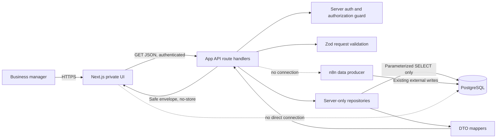

# Read-only Lead Browser Design

**Spec:** `.specs/features/read-only-lead-browser/spec.md`  
**Context:** `.specs/features/read-only-lead-browser/context.md`  
**Phase:** Design  
**Status:** APPROVED through RLB-T005 — bounded query envelope approved; bootstrap not started

## Architecture Overview

The application is a new Next.js App Router project with strict TypeScript. It is **a browser for eligible, readable, retained decisions**, not an authoritative inventory of every analysis ever produced. Authenticated browser pages call only authenticated GET route handlers. Route handlers validate input, invoke server-only repositories, map database rows into explicit DTOs, and return safe envelopes. PostgreSQL credentials and raw rows never cross the server boundary.

This design is an implementation framework, not current authorization to bootstrap. The evidence-gate outputs determine the eligible production predicate, readable-field contract, enabled query capability matrix, history caveat, report/evidence exposure, and whether batch/source views exist at all.



The diagram is source-only because `mermaid-studio` is not installed. It must be rendered/validated during plan approval or bootstrap.

## Technology Direction

Exact package versions are selected during bootstrap from current stable releases and locked in `pnpm-lock.yaml`; this plan does not invent versions.

| Concern | Planned choice | Constraint |
| --- | --- | --- |
| Framework | Next.js App Router, TypeScript strict | Pages under `src/app`; route handlers under `src/app/api` |
| Styling | Tailwind CSS; shadcn/ui only for selected primitives | No dashboard/chart dependency |
| Request validation | Zod | Validate before repository calls |
| Database | Minimal PostgreSQL driver with typed row interfaces | Server-only, parameterized `SELECT`, no ORM migration engine |
| Authentication | Auth.js server sessions with the organization-managed OIDC provider | Exact issuer + `org_id` authorization; implementation remains RLB-T017 |
| Tables | Server-driven table components; TanStack Table only if it reduces UI complexity | Only evidence-approved sorting/filtering/counts are exposed; pagination alone is not a query-safety control |
| Unit/component tests | Vitest plus React Testing Library | Synthetic data only |
| End-to-end tests | Provider-mocked auth plus a dedicated disposable PostgreSQL database | Synthetic data only; never use a live provider or production data |

## Code Reuse Analysis

This is a greenfield repository. There is no application code, package manifest, test harness, component library, or prior feature plan to reuse.

| Existing asset | How it is used |
| --- | --- |
| `AGENTS.md` | Binding project, security, layout, API, test, and scope conventions |
| `docs/db/schema.sql` | DDL evidence for read queries and DTO source mapping; never executed as a production migration |
| `docs/db/tables.txt`, `views.txt`, `functions.txt` | Present but empty; no design claims are based on them |
| Sanitized n8n docs | Not present; no n8n behavior is assumed |

## Data Access Design

### Source-discovery correction

The detailed `lead_decisions` query and field maps below are retained as prior
design evidence, but they are not implementable contracts for the currently
connected target. Its prior exact aggregate count was zero.

After the grants were corrected, the revised aggregate audit completed under
role `rlb_readonly` with `transaction_read_only = on`, `SELECT` on all six
targets, and no checked write privileges. The approved bounded source design is:

| Product need | Revised audit target | Current decision |
| --- | --- | --- |
| Current list/detail | `company_validations` | Approved as a mutable current projection for this production-like contract; 20/20 rows passed bounded structural readability checks |
| Recommended action/provenance | Exact terminal `company_validation_runs` row joined by `company_validations.last_lead_run_id` | Require exactly one approved terminal row with matching CNPJ/source and stored action; exclude operational `RECEBIDO` rows |
| History | Distinct terminal `company_validation_runs` rows by `lead_run_id` | Retained-only and incomplete by definition; conditional on production-scope and retention approval |
| Strategic report | `company_strategic_research_reports` by exact selected run plus validation/CNPJ checks | Structurally approved; content withheld pending privacy policy; zero/multiple matches are missing/ambiguous |
| Batch/source | `lead_import_batches` | Disabled because its sole row matches none of the audited projection/run/report batch references |
| Comparison views | `vw_dashboard_empresaqui`, `vw_company_validation_runs_latest_per_company` | Comparison only; neither is the primary DTO source |

All audited run and report rows are test-tagged. This is a production-like
structural contract, not evidence of real-production coverage. RLB-T003 accepts
the 20/20 structural result only within that bounded sample and defines the
fail-closed production contract below.

### Approved RLB-T003 production and authorization contract

| Concern | Approved design |
| --- | --- |
| Identity | Server-only Auth.js integration with the organization-managed OIDC provider; no local users or passwords |
| Organization access | Exact verified issuer + non-empty subject + single exact `org_id` equal to server configuration; email/domain never authorizes |
| Production marker | The selected current projection is production-eligible only through its exact terminal run when `test_case_id IS NULL`; non-null is test, and batch `PRODUCTION_E2E` is not an execution-mode signal |
| Time/version | No lower time/version allowlist; require non-future validation/run times and non-empty `agent_version`; retained expired rows are stale, not silently removed |
| Terminal contract | Exactly one integrity-`OK` `INSERIDO_VALIDATION` row by `last_lead_run_id`, with exact CNPJ and null-safe batch/source match plus non-empty stored action |
| Coverage | T002's 20/20 is accepted only as bounded production-like evidence; production activation requires a non-zero denominator, 100% readable candidates, and zero unclassified candidates |
| Unknown domains | Exact approved action/priority/default review mappings only; all other safe values are neutral/unmapped and never change eligibility or ranking |
| Confidence | No low-confidence token is approved initially; review, null, and unknown are neutral and confidence is never inferred from another field |
| Database access | Dedicated runtime role with column-level `SELECT` on the approved projection/run fields only; no table-wide, write, DDL, producer, raw-content, report, CRM, batch, sequence, or function grants |
| Tests | Synthetic unit fixtures/provider claims and a dedicated disposable PostgreSQL database guarded by a test-only DSN; no production data or live identity provider |

The exact field grants, domain labels, secret owners, coverage denominator, and
test safeguards are normative in the RLB-T003 approval table in `context.md`.
Later gates may narrow this contract; they may not widen it implicitly.

### Latest eligible decision

The RLB-T005-approved current selection follows this logical order:

1. Read `company_validations` as one mutable current projection per CNPJ.
2. Require the exact selected terminal run to have `test_case_id IS NULL`; the
   audited batch relationship and `PRODUCTION_E2E` value cannot supply or
   override production status.
3. Require valid matching `cnpj`/`cnpj_normalizado` and projection integrity
   `OK`.
4. Join by exact `last_lead_run_id` and require exactly one approved terminal
   `company_validation_runs` row with matching CNPJ and batch/source position.
5. Require a stored `final_action`; treat zero or multiple terminal rows and
   unknown terminal result types as unreadable.
6. Apply only exact CNPJ, exact UF, or exact approved-priority filters.
7. Sort only by `company_validations.validated_at DESC,
   company_validations.id DESC`.
8. Enforce the unfiltered `company_validations` source guard of at most 20
   rows, use `pageSize` 20, and run the approved exact matching count
   sequentially. If the guard fails, return a safe unavailable response rather
   than partial data.

Do not rank the operational run log by CNPJ to invent a current row. The
projection's exact `last_lead_run_id` relationship is the audited current
identity.

### Detail selection

- Normalize and validate the CNPJ.
- With no `leadRunId`, use the same latest eligibility and ordering as the list.
- With `leadRunId`, require an exact CNPJ + run match with `test_case_id IS
  NULL`; do not infer mode from batch metadata.
- Return `404 LEAD_NOT_FOUND` for no eligible match; do not reveal whether an excluded/test run exists.
- Extract only allowlisted JSON paths and native columns needed by the DTO.

### History selection

- Query `company_validation_runs` by exact normalized CNPJ and the approved
  production/test predicate.
- Include exactly one approved terminal row per distinct `lead_run_id`; exclude
  `RECEBIDO` and every other operational row.
- Require non-null run identity, matching CNPJ/source provenance, integrity
  `OK`, and a stored final action. Ambiguous run shapes are unavailable.
- Sort terminal rows by `created_at DESC, id DESC`.
- Paginate and return the total.
- Never merge distinct run IDs by batch, source row, CNPJ, or action.
- RLB-T004 classifies retention completeness as `incomplete/unknown`. History is
  retained-only and remains subject to production activation and the RLB-T005
  six-terminal-row ceiling.
- Metadata and UI copy use “Histórico disponível” or “Análises retidas
  encontradas” and state “Análises mais antigas podem não estar presentes.”
- Never label returned rows as a complete audit trail or every analysis ever produced.

### Strategic report and evidence selection

- Report/evidence retrieval remains disabled because no current field or
  content class is semantically allowlisted. The approved default state is
  `omitted_by_policy`.
- Query `company_strategic_research_reports` only by exact selected `lead_run_id` and CNPJ.
- Ignore test rows unless an approved production predicate exists.
- Require `integrity_status = 'OK'` to render content.
- Zero matching rows means `missing`.
- One matching eligible row means `available`.
- More than one matching eligible row means `ambiguous`; do not silently attach content.
- An expired row may still be read but must be labeled `stale` from stored `expires_at`.
- Do not expose `raw_payload` or `integrity_error`.
- No CNPJ-only report fallback is permitted in MVP.
- Any future exposure requires a named-owner allowlist of exact fields/content
  classes and review for semantic PII, confidential business content, safe
  deterministic redaction, URL safety, authorization, and logging.
- XSS sanitization is not privacy approval. Structurally valid or XSS-safe
  content that is semantically uncertain is omitted.

### Optional batch/source selection

- RLB-T004 defers all batch/source routes and screens. The audited batch is not
  linked to the selected lead/run/report records, and its counters can be
  mistaken for import progress.
- Do not implement `BatchSourceSummary`, `/api/imports`, batch filtering,
  aggregate counts, or batch navigation under the current contract.
- An exact batch/source identifier may appear only as audit provenance for an
  already authorized lead decision. It has no status, percentage, aggregate,
  link, or progress wording.
- Future enablement requires linked lineage plus reviewer approval that every
  selected field, label, aggregate, and navigation behavior cannot reasonably
  imply import progress or operational monitoring.

### Approved sensitive-content boundary

- Semantic PII includes names, email addresses, phone numbers, personal
  identifiers, person-linked free text, and PII embedded in URLs.
- Confidential content includes pricing, contracts, credentials/tokens,
  internal notes, CRM history, prompts, proprietary strategy, and
  customer-restricted information.
- Only exact fields/content classes approved by a named business data owner and
  privacy/security reviewer may enter a mapper. Unknown, mixed, or unclassified
  content is omitted.
- Redaction must be deterministic and tested, must not return the original, and
  must leave meaning that is independently approved as safe. Otherwise omit the
  item or section.
- CRM company/contact snapshots remain deferred unless separately approved
  under this same boundary.
- Server-side organization authorization, exact run/CNPJ binding,
  least-privilege field grants, mapped DTOs, and `private, no-store` delivery
  are mandatory but do not themselves approve content privacy.
- Logs, traces, analytics, errors, fixtures, and screenshots contain no
  report/evidence bodies, raw Markdown/JSON, evidence URLs or query/fragment
  values, contacts, prompts, CRM history, or redacted originals.

### Query safety

- All values use bound parameters.
- Sort keys map to hardcoded SQL fragments; client strings are never interpolated as SQL identifiers.
- Text search escapes `%`, `_`, and the chosen escape character.
- Repositories accept validated domain query objects rather than raw `URLSearchParams`.
- Connection acquisition, transactions, and query timeout remain server-only.
- The deployed role has `SELECT` on approved objects only and no create/write privileges.
- The application does not execute `docs/db/schema.sql`.

Pagination limits returned rows but does not bound the work required to rank,
filter, sort, extract JSON, or count. RLB-T005 therefore approves only this
matrix:

| Control | Status | SQL/index contract |
| --- | --- | --- |
| Current relation | Enabled | Current projection plus exactly one exact terminal run; unfiltered source guard `<= 20`. |
| `page`, `pageSize` | Narrowed | Default `1`/`20`; maximum page size `20`; exact match total enabled under the same guard. |
| Ordering | Narrowed | Fixed `validated_at DESC, id DESC`; no client sort/direction. |
| `cnpj` | Enabled | One exact normalized CNPJ; unique CNPJ index. |
| `uf` | Narrowed | One exact uppercase UF; leading `(uf, cidade)` index key. |
| `priority` | Narrowed | One exact approved token; leading priority-composite index key. |
| Detail | Enabled | Exact CNPJ and optional exact matching run ID; CNPJ/run indexes. |
| History | Narrowed | Exact CNPJ, fixed `created_at DESC, id DESC`, page size 20, exact retained total, at most six terminal rows per CNPJ. |
| Name/partial CNPJ/city/action/trust/score/date/batch filters | Deferred | Missing compatible leading indexes, unselective/no representative evidence, or a prior semantic deferral. |
| Alternate sorts/directions | Deferred | Require unproven explicit sorts. |
| JSON selection or predicates | Deferred | Sequential measured work, unknown payload-scale behavior, and no field/content grant. |

All list/count predicates are identical except projection and aggregation.
Count and data statements run sequentially. The source guard and history
ceiling fail closed with a safe unavailable response. They do not truncate or
silently omit later rows.

The runtime database envelope is `statement_timeout = 2s`,
`lock_timeout = 500ms`, idle-in-transaction timeout at most 5 seconds, pool
acquisition timeout at most 1 second, and a global application budget of two
connections/statements. The initial deployment is one instance with pool
minimum 0 and maximum 2; any scale-out must preserve
`instance_count × pool_max <= 2`.

The sanitized audit measured the current and surrogate list, count, exact
detail, exact-CNPJ history, representative selective/unselective filters, every
candidate sort, and structural/computed JSON work. At the observed 20 current
rows and 240 run rows, measured execution remained below 2.1 ms with no
temporary I/O; the highest fresh-connection planning time was 17.555 ms. Two
concurrent sessions completed 50 bounded probes in 173 ms. This provides
timeout and two-session headroom, but no cardinality headroom beyond 20 current
rows or six terminal history rows per CNPJ.

The review records sanitized metrics only. It commits no SQL parameter
containing business data, raw row, payload, report/evidence content, or
credential.

## Read-only DTOs

API DTO dates are ISO-8601 UTC strings. UI formatters convert them to `dd/MM/yyyy` in `America/Sao_Paulo`. Nullable fields are present with `null`; they are not omitted or replaced with zero.

```ts
type Nullable<T> = T | null

interface LeadSummary {
  cnpj: string
  companyName: Nullable<string>
  city: Nullable<string>
  uf: Nullable<string>
  sector: Nullable<string>
  score: Nullable<number>
  priority: Nullable<string>
  recommendedAction: Nullable<string>
  trustStatus: Nullable<string>
  confidenceIndicator: "normal" | "low" | "unknown"
  lastAnalysisAt: string
  decisionId: string
  leadRunId: string
  importBatchId: string
  sourceRow: number
}

interface LeadDetail extends LeadSummary {
  legalName: Nullable<string>
  tradeName: Nullable<string>
  primaryCnae: Nullable<string>
  primaryCnaeDescription: Nullable<string>
  companySize: Nullable<string>
  taxRegime: Nullable<string>
  estimatedRevenue: Nullable<string>
  employeeCount: Nullable<string>
  branchCount: Nullable<number>
  preTrustScore: Nullable<number>
  preTrustStatus: Nullable<string>
  finalVerdict: Nullable<string>
  recommendedActionReason: Nullable<string>
  agentSummary: Nullable<string>
  icpScore: Nullable<number>
  strategicAssetScore: Nullable<number>
  riskFlags: Nullable<LeadRisk[]>
  positiveSignals: Nullable<LeadSignal[]>
  evidences: Nullable<LeadEvidence[]>
  strategicReport: StrategicReport
  contactSnapshot: Nullable<ContactSnapshot>
  audit: LeadAudit
  dataQuality: DataQualityNotice[]
}

interface LeadHistoryItem {
  decisionId: string
  leadRunId: string
  importBatchId: string
  sourceRow: number
  analyzedAt: string
  score: Nullable<number>
  finalVerdict: Nullable<string>
  recommendedAction: Nullable<string>
  recommendedActionReason: Nullable<string>
  priority: Nullable<string>
  trustStatus: Nullable<string>
  agentVersion: string
  sourceHash: string
  usedCache: boolean
  decisionStatus: "COMPLETED" | "SUPERSEDED_MANUALLY"
  supersededAt: Nullable<string>
  supersededByDecisionId: Nullable<string>
  isCurrent: boolean
}

interface BatchSourceSummary {
  importBatchId: string
  sourceSystem: string
  originalFilename: Nullable<string>
  expectedRowCount: Nullable<number>
  savedDecisionCount: number
  analyzedCompanyCount: number
  firstSeenAt: string
  lastSeenAt: string
  workflowVersion: string
  rulesetVersion: string
  promptModelVersion: string
  executionMode: string
}
```

Supporting DTOs are deliberately narrow:

```ts
interface LeadRisk {
  label: string
  severity: Nullable<string>
}

interface LeadSignal {
  label: string
}

interface LeadEvidence {
  label: string
  source: Nullable<string>
  url: Nullable<string> // validated https URL only
}

interface StrategicReport {
  status: "available" | "missing" | "unavailable" | "withheld" | "ambiguous"
  markdown: Nullable<string>
  confidenceLevel: Nullable<string>
  createdAt: Nullable<string>
  expiresAt: Nullable<string>
  isStale: boolean
  source: Nullable<"company_strategic_research_reports">
}

interface ContactSnapshot {
  name: Nullable<string>
  email: Nullable<string>
  phone: Nullable<string>
  loadedAt: string
}

interface LeadAudit {
  inputRowId: string
  idempotencyKey: string
  sourceHash: string
  workflowVersion: string
  rulesetVersion: string
  promptModelVersion: string
  strategicResearchVersion: Nullable<string>
  executionMode: string
  usedCache: boolean
  researchStatus: Nullable<string>
  expiresAt: string
}

interface DataQualityNotice {
  code:
    | "MISSING_VALUE"
    | "MALFORMED_COLLECTION"
    | "UNKNOWN_DOMAIN_VALUE"
    | "STALE_REPORT"
    | "AMBIGUOUS_REPORT"
    | "CONTENT_WITHHELD"
    | "MUTABLE_CONTACT_SNAPSHOT"
  field: string
}
```

### `LeadSummary` field map

| DTO field | Source table/view | Source column/path | Required / nullable / derived | Caveat or safety note |
| --- | --- | --- | --- | --- |
| `cnpj` | `lead_decisions` | `cnpj_normalizado` | Required by query | Query excludes null; format only after 14-digit validation. |
| `companyName` | `lead_decisions` | `decision_payload #>> '{company,nomeFantasia}'`, fallback `razaoSocial` | Nullable, derived fallback | Empty strings normalize to null. |
| `city` | `lead_decisions` | `decision_payload #>> '{company,cidade}'` | Nullable | Never derive from unrelated CRM rows. |
| `uf` | `lead_decisions` | `decision_payload #>> '{company,uf}'` | Nullable | Uppercase only if value is a valid two-letter UF; preserve unknown safely. |
| `sector` | `lead_decisions` | `decision_payload #>> '{company,textoCnaePrincipal}'` | Nullable | Description, not a canonical sector taxonomy. |
| `score` | `lead_decisions` | `final_score` | Nullable | Native `0..100` constraint; do not fall back to pre-trust score. |
| `priority` | `lead_decisions` | `priority` | Nullable | Free text; label map requires data profiling. |
| `recommendedAction` | `lead_decisions` | `final_action` | Nullable | Display stored action; never recalculate. |
| `trustStatus` | `lead_decisions` | `trust_status` | Nullable | Free text; unknown values remain unknown. |
| `confidenceIndicator` | mapper | Approved mapping from `trust_status` | Derived | Returns `unknown` for null/unmapped values. |
| `lastAnalysisAt` | `lead_decisions` | `created_at` | Required | Analysis persistence time, not necessarily producer start time. |
| `decisionId` | `lead_decisions` | `decision_id` | Required | Primary audit identity. |
| `leadRunId` | `lead_decisions` | `lead_run_id` | Required | Preserved in list link and detail selection. |
| `importBatchId` | `lead_decisions` | `import_batch_id` | Required | Audit/source identity; not an import action. |
| `sourceRow` | `lead_decisions` | `source_row` | Required | Source row within batch. |

### `LeadDetail` field map

Inherited `LeadSummary` fields use the mappings above.

| DTO field | Source table/view | Source column/path | Required / nullable / derived | Caveat or safety note |
| --- | --- | --- | --- | --- |
| `legalName` | `lead_decisions` | `decision_payload #>> '{company,razaoSocial}'` | Nullable | JSON shape is evidenced by `company_latest_validation`; actual rows still need profiling. |
| `tradeName` | `lead_decisions` | `decision_payload #>> '{company,nomeFantasia}'` | Nullable | Do not substitute CRM name silently. |
| `primaryCnae` | `lead_decisions` | `decision_payload #>> '{company,cnaePrincipal}'` | Nullable | Render as stored text. |
| `primaryCnaeDescription` | `lead_decisions` | `decision_payload #>> '{company,textoCnaePrincipal}'` | Nullable | No taxonomy enrichment. |
| `companySize` | `lead_decisions` | `decision_payload #>> '{fiscal,porteEmpresa}'` | Nullable | Stored producer text. |
| `taxRegime` | `lead_decisions` | `decision_payload #>> '{fiscal,regimeTributarioAtual}'` | Nullable | Stored producer text. |
| `estimatedRevenue` | `lead_decisions` | `decision_payload #>> '{commercial,faturamentoEstimado}'` | Nullable | Schema exposes text, so do not parse/format as currency unless a numeric contract is approved. |
| `employeeCount` | `lead_decisions` | `decision_payload #>> '{commercial,quadroFuncionarios}'` | Nullable | Stored text/range, not a guaranteed integer. |
| `branchCount` | `lead_decisions` | `decision_payload #>> '{company,quantidadeFiliais}'` | Nullable, parsed | Accept integer `>= 0`; malformed/missing remains null. Do not use helper default `0`. |
| `preTrustScore` | `lead_decisions` | `decision_payload ->> 'preTrustScore'` | Nullable, parsed | `0..100`; audit context only, never replaces final score. |
| `preTrustStatus` | `lead_decisions` | `decision_payload ->> 'preTrustStatus'` | Nullable | Audit context. |
| `finalVerdict` | `lead_decisions` | `final_verdict` | Nullable | Stored verdict; free text. |
| `recommendedActionReason` | `lead_decisions` | `final_action_reason` | Nullable | Safe text, length bounded in response mapping. |
| `agentSummary` | `lead_decisions` | `decision_payload #>> '{agentValidation,resumo}'` | Nullable | Plain text only. |
| `icpScore` | `lead_decisions` | `decision_payload ->> 'icpScore'` | Nullable, parsed | Accept `0..100`; no default zero. |
| `strategicAssetScore` | `lead_decisions` | `decision_payload ->> 'strategicAssetScore'` | Nullable, parsed | Accept `0..100`; no default zero. |
| `riskFlags` | `lead_decisions` | `decision_payload #> '{risk,riskFlags}'`, fallback `'{agentValidation,riscosEncontrados}'` | Nullable, mapped | Missing is null; valid empty array is `[]`; malformed shape is null plus notice. |
| `positiveSignals` | `lead_decisions` | `decision_payload #> '{agentValidation,sinaisPositivos}'` | Nullable, mapped | Allowlisted text/object fields only. |
| `evidences` | No database selection under the current contract | None | Policy state only | Return `omitted_by_policy`; no current evidence field/content class is semantically allowlisted. A later approval must replace this with exact source fields and tested redaction/omission rules. |
| `strategicReport` | No content selection under the current contract | None | Policy state only | Return `omitted_by_policy`; do not retrieve report Markdown/JSON. A future exact-run mapping requires a separate content-owner allowlist approval. |
| `contactSnapshot` | `crm_company_history` | `latest_contact_name/email/phone`, `loaded_at` via stored CRM key | Nullable, conditional | PII and mutable; disabled until approved. |
| `audit.inputRowId` | `lead_decisions` | `input_row_id` | Required | Do not expose source raw row. |
| `audit.idempotencyKey` | `lead_decisions` | `idempotency_key` | Required | Display in advanced audit only; do not implement idempotency behavior. |
| `audit.sourceHash` | `lead_decisions` | `source_hash_sha256` | Required | DTO prefixes with `sha256:` consistently. |
| `audit.workflowVersion` | `lead_decisions` | `workflow_version` | Required | Business label “Versão do agente” if approved. |
| `audit.rulesetVersion` | `lead_decisions` | `ruleset_version` | Required | Advanced audit only. |
| `audit.promptModelVersion` | `lead_decisions` | `prompt_model_version` | Required | Advanced audit only. |
| `audit.strategicResearchVersion` | `lead_decisions` | `strategic_research_version` | Nullable | Advanced audit only. |
| `audit.executionMode` | `lead_decisions` | `execution_mode` | Required | Also participates in production-scope filtering. |
| `audit.usedCache` | `lead_decisions` | `used_cache` | Required | Provenance only; no cache behavior in app. |
| `audit.researchStatus` | `lead_decisions` | `research_status` | Nullable | Do not interpret as import progress. |
| `audit.expiresAt` | `lead_decisions` | `expires_at` | Required | Stored producer expiry; app does not refresh. |
| `dataQuality` | mapper | mapper validation outcomes | Derived | Codes only; never expose raw malformed content. |

### `LeadHistoryItem` field map

| DTO field | Source table/view | Source column | Required / nullable / derived | Caveat or safety note |
| --- | --- | --- | --- | --- |
| `decisionId` | `lead_decisions` | `decision_id` | Required | Never collapse. |
| `leadRunId` | `lead_decisions` | `lead_run_id` | Required | Never collapse. |
| `importBatchId` | `lead_decisions` | `import_batch_id` | Required | Audit reference. |
| `sourceRow` | `lead_decisions` | `source_row` | Required | Audit reference. |
| `analyzedAt` | `lead_decisions` | `created_at` | Required | Persistence timestamp. |
| `score` | `lead_decisions` | `final_score` | Nullable | No fallback/default. |
| `finalVerdict` | `lead_decisions` | `final_verdict` | Nullable | Stored value. |
| `recommendedAction` | `lead_decisions` | `final_action` | Nullable | Stored value. |
| `recommendedActionReason` | `lead_decisions` | `final_action_reason` | Nullable | Stored value. |
| `priority` | `lead_decisions` | `priority` | Nullable | Free text. |
| `trustStatus` | `lead_decisions` | `trust_status` | Nullable | Free text. |
| `agentVersion` | `lead_decisions` | `workflow_version` | Required | The schema view aliases this as agent version. |
| `sourceHash` | `lead_decisions` | `source_hash_sha256` | Required, formatted | Prefix `sha256:` in mapper. |
| `usedCache` | `lead_decisions` | `used_cache` | Required | Provenance only. |
| `decisionStatus` | `lead_decisions` | `decision_status` | Required | Schema constraint allows two values. |
| `supersededAt` | `lead_decisions` | `superseded_at` | Nullable | Mutable audit metadata. |
| `supersededByDecisionId` | `lead_decisions` | `superseded_by_decision_id` | Nullable | Schema has no FK; render as text reference only. |
| `isCurrent` | mapper | equality with latest eligible `decision_id` | Derived | Does not modify history. |

### `BatchSourceSummary` field map

| DTO field | Source table/view | Source column | Required / nullable / derived | Caveat or safety note |
| --- | --- | --- | --- | --- |
| `importBatchId` | `lead_import_batches` | `import_batch_id` | Required | Stable source identity. |
| `sourceSystem` | `lead_import_batches` | `source_system` | Required | Expected EmpresaAqui but do not hardcode display evidence. |
| `originalFilename` | `lead_import_batches` | `original_filename` | Nullable | Potentially sensitive; display basename only and escape text. |
| `expectedRowCount` | `lead_import_batches` | `row_count_expected` | Nullable | Declared expectation, not confirmed progress. |
| `savedDecisionCount` | `lead_decisions` aggregate | `count(decision_id)` by batch | Derived | Counts persisted eligible decisions, not completed source rows. |
| `analyzedCompanyCount` | `lead_decisions` aggregate | `count(distinct cnpj_normalizado)` by batch | Derived | Distinct companies, not rows. |
| `firstSeenAt` | `lead_import_batches` | `first_seen_at` | Required | Producer receipt timestamp. |
| `lastSeenAt` | `lead_import_batches` | `last_seen_at` | Required | Mutable on replay. |
| `workflowVersion` | `lead_import_batches` | `workflow_version` | Required | Audit only. |
| `rulesetVersion` | `lead_import_batches` | `ruleset_version` | Required | Audit only. |
| `promptModelVersion` | `lead_import_batches` | `prompt_model_version` | Required | Audit only. |
| `executionMode` | `lead_import_batches` | `execution_mode` | Required | Apply approved production predicate. |

## API Contracts

All routes require authentication and authorization. Success uses `{ data, meta? }`; failure uses `{ error: { code, message, details? } }`. `details` may contain field-level validation issues only and never database/internal payloads.

### `GET /api/leads`

Query parameters:

| Parameter | Contract |
| --- | --- |
| `page` | Integer, default `1`, min `1` |
| `pageSize` | Integer, default and max `20`, min `1` |
| `cnpj` | Formatted or digits-only CNPJ; normalize to exactly 14 digits |
| `uf` | One valid uppercase Brazilian UF code |
| `priority` | One exact RLB-T003-approved priority token |

Response:

```ts
{
  data: LeadSummary[]
  meta: {
    page: number
    pageSize: number
    total: number
    totalPages: number
  }
}
```

Ordering is fixed to `validated_at DESC, id DESC`. The unfiltered current
projection must contain at most 20 rows; otherwise the route returns a safe
unavailable error and no partial result. `q`, partial CNPJ, `city`, `action`,
`trustStatus`, score/date/batch filters, JSON filters, `sort`, `direction`, and
every other query parameter are rejected before repository access.

### `GET /api/leads/:cnpj`

Path CNPJ follows the same normalization contract. Optional query `leadRunId` must match `^lr_[0-9a-f]{64}$`.

Response: `{ data: LeadDetail }`.

`404 LEAD_NOT_FOUND` is safe and does not disclose excluded/test data.

### `GET /api/leads/:cnpj/history`

Semantically approved by RLB-T004 for retained-only history; implementation
still requires production activation and must enforce the RLB-T005 history
ceiling.

Query parameters: `page` default `1`, `pageSize` default and max `20`.

Response:

```ts
{
  data: LeadHistoryItem[]
  meta: {
    page: number
    pageSize: number
    total: number
    completeness: "retained_only" | "proven_complete"
    label: "Histórico disponível" | "Análises retidas encontradas"
    caveat: string
  }
}
```

Under the current `incomplete/unknown` classification, `completeness` is
`retained_only` and `caveat` is “Análises mais antigas podem não estar
presentes.” More than six retained terminal rows for the exact CNPJ exceeds the
approved performance envelope and returns `503 HISTORY_UNAVAILABLE`. It must
not truncate, fall back to event tables, or imply completeness.

### `GET /api/imports` — conditional P2

Deferred by RLB-T004. This route does not exist under the approved contract.

### `GET /api/imports/:id` — conditional P2

Deferred by RLB-T004. This route does not exist under the approved contract.

### Safe error catalog

| HTTP | Code | Business-safe message |
| --- | --- | --- |
| 400 | `VALIDATION_ERROR` | “Revise os filtros informados.” |
| 401 | `AUTHENTICATION_REQUIRED` | “Entre para acessar os dados.” |
| 403 | `ACCESS_DENIED` | “Você não tem acesso a esta área.” |
| 404 | `LEAD_NOT_FOUND` | “Empresa não encontrada.” |
| 503 | `HISTORY_UNAVAILABLE` | “O histórico não está disponível no momento.” |
| 503 | `DATA_SOURCE_UNAVAILABLE` | “Não foi possível consultar os dados agora.” |
| 500 | `UNEXPECTED_ERROR` | “Ocorreu um erro inesperado. Tente novamente.” |

Server logs may include a generated request/error ID and error category, but not full CNPJ, contact data, strategic reports, SQL text/parameters, or raw payloads.

## Validation Rules

### Pagination

- Parse only base-10 integer strings.
- Reject decimal, exponent, sign, whitespace-only, repeated, or out-of-range values.
- `page >= 1`; list and history `pageSize <= 20`; batch routes remain deferred.
- A page beyond the total returns `200` with an empty `data` array and accurate metadata.

### Sorting

- The list has no `sort` or `direction` parameter.
- Use only `validated_at DESC, id DESC`; history uses only
  `created_at DESC, id DESC`.
- Reject every client-supplied sorting key or direction before repository
  access.

### Filters and text search

- Accept only exact normalized CNPJ, one exact uppercase UF, and one exact
  approved priority token.
- Combine approved filters with `AND`; empty strings are invalid rather than
  `IS NULL`.
- No wildcard, company-name, partial CNPJ, city, action, trust, score, date,
  batch, or JSON search/filter exists in the approved contract.
- Unknown producer domain values are displayed with a neutral fallback and are
  not filter controls.

### CNPJ

- Accept digits with optional `.`, `/`, and `-` presentation punctuation.
- Strip approved punctuation and require exactly 14 digits, matching the current repository formatting contract.
- Do not claim tax-registry validity from length alone.
- Format valid normalized values as `00.000.000/0000-00`.

### Dates

- No date query parameter is accepted under the RLB-T005 matrix.
- Stored timestamps remain ISO-8601 UTC in DTOs and are formatted for display
  in `America/Sao_Paulo`.

### Scores

- No score query parameter is accepted under the RLB-T005 matrix.
- Stored scores remain nullable integers in the `0..100` contract and are not
  coalesced to zero.

### JSON collections

- No JSON collection column or path is selected under the RLB-T005 matrix.
- Risk, signal, evidence, and report sections use the approved
  unavailable/omitted policy state without accepting raw JSON input.
- A later approval must remeasure exact projection paths and payload sizes
  before adding mapper validation or collection-shape semantics.

### Markdown and URLs

- Do not retrieve or return report/evidence content under the current contract;
  the policy is approved but its semantic allowlist is empty.
- Parse Markdown without raw HTML support.
- Sanitize output using an allowlist of elements and attributes.
- Disallow scripts, iframes, forms, inline styles, event attributes, data URLs, and embedded remote content.
- Return clickable links only after separate content approval and only for
  absolute normalized `https:` URLs with no username/password, no token or
  semantic PII in path/query/fragment, and an explicitly approved public
  hostname that is not a known redirector. Reject localhost and
  private/link-local IP destinations. Do not resolve redirects or attest to
  downstream redirect destinations.
- Use `target="_blank"`, `rel="noopener noreferrer"`, and a no-referrer policy.
- Do not fetch evidence URLs server-side.
- Treat sanitization as XSS defense only. It is not privacy approval or proof
  of confidentiality, authorization, data minimization, truth, or destination
  safety.

## Components and Interfaces

### Authentication boundary

- **Location:** `src/server/auth/`, route middleware/gateway per selected stable Next.js/auth pattern.
- **Purpose:** Validate session and single-organization authorization for pages and APIs.
- **Interfaces:** `requirePageSession(): Promise<Session>` and `requireApiSession(): Promise<Session>`.
- **Dependency:** Approved OIDC provider and organization claim.

### Database client

- **Location:** `src/server/db/`
- **Purpose:** Own server-only pool configuration, query timeout, and typed query execution.
- **Interface:** `query<Row>(statement: SqlStatement): Promise<Row[]>`.
- **Safety:** `server-only` import guard, no browser export, no migration API.

### Lead repositories

- **Location:** `src/server/repositories/lead-list-repository.ts`, `lead-detail-repository.ts`, `lead-history-repository.ts`
- **Purpose:** Execute parameterized SELECTs over approved relations.
- **Interfaces:**
  - `listLeads(query: LeadListQuery): Promise<Page<LeadSummary>>`
  - `getLeadDetail(cnpj: string, leadRunId?: string): Promise<LeadDetail | null>`
  - `listLeadHistory(cnpj: string, page: PageRequest): Promise<Page<LeadHistoryItem>>`
- **Dependencies:** DB client, row types, DTO mappers, approved production predicate, readable-field contract, and query capability matrix.

### DTO mappers

- **Location:** `src/server/mappers/`
- **Purpose:** Convert database rows/JSON into bounded, null-aware DTOs.
- **Safety:** Never pass raw payload fields through.

### Validators and formatters

- **Location:** `src/lib/validators/`, `src/lib/formatters/`
- **Purpose:** Request schemas and Brazilian presentation.
- **Interfaces:** Pure functions with unit tests.

### API route handlers

- **Location:** `src/app/api/leads/`, `src/app/api/imports/`
- **Purpose:** Auth → validation → repository → envelope → safe error mapping.
- **Safety:** GET only; `Cache-Control: private, no-store`.

### UI screens

- **Location:** `src/app/(private)/leads/`
- **Purpose:** Lead list, detail, and conditional history.
- **Components:** approved filters, table, recommendation summary, unavailable
  risk/signal/evidence/report states, audit details, and page states.
- **Safety:** No raw payload renderer; no database imports.

## Read-only MVP Screens

### Login/private access

- Provider-specific login entry and safe authentication errors.
- No lead preview or count before authentication.
- Redirect authenticated users to `/leads`.

### Lead list

- Exact CNPJ, exact UF, and exact approved-priority filters only.
- Columns: Company, CNPJ, City/UF, sector, Score, Priority, Recommended action, Trust status, Last analysis, source batch.
- Badges use approved mapping with neutral fallback.
- URL query parameters preserve filters and page.
- Skeleton, no-data, no-match, API-error, and access states.
- Scope copy explains that results are eligible, readable, retained decisions and are not proof of every analysis ever produced.

### Lead detail

- Header: company identity, location, CNPJ, latest analysis date.
- Decision summary: score, action, priority, verdict, trust warning, reason.
- Company/fiscal/commercial sections with explicit unavailable values.
- Risks and positive signals when approved; evidence and strategic report only after semantic privacy/confidential-content approval, otherwise an omitted/withheld state.
- Audit section: decision/run/batch/source-row/hash/version/provenance identifiers.
- Optional contact snapshot is absent until PII approval.

### History/audit

- Reverse-chronological decision list.
- Each row links to the exact `leadRunId` detail.
- Current and superseded labels.
- Label as “Histórico disponível” or “Análises retidas encontradas.”
- State “Análises mais antigas podem não estar presentes.”
- No operational retry/stage timeline.

### Batch/source — conditional P2

- Deferred by RLB-T004; no screen, route, aggregate, filtered-list link, or
  navigation is implemented under the current contract.
- Exact batch/source identifiers may appear only in collapsed audit provenance
  for an already authorized decision, without progress or status semantics.

## Security Model

1. Authentication is required for all private layouts and API routes.
2. Authorization is revalidated server-side; a client-visible session is not sufficient proof.
3. Private responses use `Cache-Control: private, no-store`; authenticated server rendering opts out of shared caching.
4. Database code is under `src/server`, guarded by `server-only`, and never imported into client components.
5. The database role is separately provisioned with only the minimum `SELECT` grants on approved tables/views.
6. Production credentials live only in `.env.local` or the deployment secret store; `.env.example` contains placeholders.
7. No n8n environment variable exists.
8. Queries are parameterized, use only the fixed approved sort expressions,
   reject unapproved text controls, and enforce the RLB-T005 timeouts and
   cardinality guards.
9. No route accepts a body or mutation method for lead/batch data.
10. API errors are categorized and sanitized; SQL, connection strings, stack traces, and raw payloads are never returned.
11. Logs avoid full CNPJ, email, phone, CRM history, evidence, reports, input snapshots, and SQL parameters.
12. Markdown and external links pass through content-safety boundaries before rendering.
13. Semantic PII/confidential-content review, field allowlisting, and redaction/omission precede report/evidence exposure; XSS sanitization is not treated as privacy approval.
14. Tests, fixtures, seeds, and screenshots use clearly synthetic data only.
15. The app does not execute database DDL or production migrations.
16. A dependency and route audit confirms there is no n8n client, CSV parser/upload endpoint, reprocess action, export endpoint, or lead write.

## Error and Availability Strategy

| Scenario | Server behavior | User behavior |
| --- | --- | --- |
| Invalid query/path | `400 VALIDATION_ERROR` | Identify invalid filter fields without technical details. |
| Missing/expired session | `401` | Send user to login. |
| Wrong organization | `403` | Show access denied. |
| Lead/batch absent | Safe `404` | Business empty/not-found state. |
| Database unavailable/timeout | Log safe error ID; `503` | Retry action, no stack. |
| Unexpected row shape | Fail mapping safely; log category | Field unavailable or safe `503`, depending on scope. |
| Deferred JSON collection | Do not select the column; return the approved unavailable/omitted state | “Ainda não disponível.” |
| Sensitive/uncertain report or evidence | Omit content and return withheld state | Explain that content is unavailable under the approved policy; expose no raw value. |
| Invalid evidence URL | Return item without clickable URL or omit it | Plain text/no unsafe link. |
| Ambiguous report | `StrategicReport.status = ambiguous` | Report unavailable with data-quality note. |
| History gate disabled | Safe unavailable response | “Histórico indisponível.” |
| Retained history enabled, completeness unproven | Return retained rows plus mandatory caveat | “Análises retidas encontradas. Análises mais antigas podem não estar presentes.” |

## Test Strategy

No test infrastructure exists. The bootstrap task must establish scripts before feature code:

| Layer | Required tests | Synthetic coverage |
| --- | --- | --- |
| Validators | Unit | Page/page-size bounds, repeated/unknown values, exact CNPJ, exact UF, approved priority, and rejection of deferred filters/sorts |
| Formatters/labels | Unit | CNPJ, `pt-BR` dates/currency, score, unknown/null labels, low-confidence mapping |
| DTO mappers | Unit | Scalar null/unknown values, unavailable content states, and audit preservation without JSON inputs |
| Repositories | Unit query-builder tests plus non-production integration test when approved | Exact current relation before filtering, fixed deterministic ties, source/history guards, pagination/count parity, history non-collapse |
| Auth/permissions | Unit/integration | No session, wrong organization, valid session |
| API handlers | Route-level tests with mocked auth/repositories | Success envelopes, `400`, `401`, `403`, `404`, `503`, no stack/details leak |
| Markdown/links | Unit/component | Scripts/raw HTML removed, only safe HTTPS links clickable |
| Sensitive content policy | Policy review plus mapper/component tests | Report/evidence allowlist, semantic PII/confidential examples, redaction/omission, withheld state; sanitization tested separately |
| UI components/pages | Component | Loading, no data, no match, missing report/evidence/history, low/unknown confidence, API error |
| Security/scope | Static assertions/review | No client DB import, mutation route, n8n reference, real data, DDL execution |

Planned gate commands after bootstrap:

```bash
pnpm lint
pnpm typecheck
pnpm test
pnpm build
```

Focused Vitest checks use:

```bash
pnpm vitest run -t "<test name>"
```

Repository integration tests use a dedicated disposable non-production
PostgreSQL database, a test-only role/DSN, and synthetic records. Test startup
must reject a `TEST_DATABASE_URL` equal to `DATABASE_URL`. Production snapshots,
dumps, rows, identifiers, credentials, and the live OIDC provider are
prohibited.

## Non-obvious Technical Decisions

| Decision | Choice | Rationale |
| --- | --- | --- |
| Current read model | `company_validations` plus exactly one terminal `company_validation_runs` row by `last_lead_run_id` | The aggregate audit found 20/20 structurally readable current relationships with matching CNPJ/source and stored action. |
| Read-model authority | Bounded production-like contract plus fail-closed production predicate | Every audited run/report is test-tagged; production requires `test_case_id IS NULL`, a non-zero measured denominator, 100% readability, and zero unclassified candidates. |
| Filter placement | Filter after latest-per-CNPJ ranking | Prevents older matching decisions from appearing as current. |
| History source | Distinct terminal `company_validation_runs` rows by `lead_run_id` | Excludes `RECEBIDO` operations and preserves retained run identity without claiming completeness. |
| Reports | Withheld by default; then exact `lead_run_id` and CNPJ only if policy approves | Prevents privacy leakage and cross-run report attachment. |
| Missing values | Explicit null-aware mapper | Projection/view defaults can misrepresent missing as zero/empty. |
| API surface | Authenticated GET only | Enforces read-only business scope. |
| Database changes | None | Existing schema is the source; production migrations are excluded. |
| Batch screen | Disabled for the audited contract | The sole batch row matches none of the audited projection/run/report references. |
| Query controls | Fixed date/id order; exact CNPJ plus single exact UF/priority; page size 20; exact totals behind hard row ceilings | Pagination does not make broad ranking/filter/count work safe; all other controls are deferred. |
| Caching | Private/no-store | Lead data is sensitive and user access must be revalidated. |

## Design Approval Gates

Completed design gates:

- [x] Read-only scope and the “eligible, readable, retained decisions” wording.
- [x] RLB-T002 completed an authorized aggregate contract audit of `company_validations`,
  `company_validation_runs`, `company_strategic_research_reports`,
  `lead_import_batches`, `vw_dashboard_empresaqui`, and
  `vw_company_validation_runs_latest_per_company`, including exact counts,
  relationship cardinalities, null/default/domain rates, current-row and
  terminal-row semantics, time/version variation, and unreadable/unclassified
  coverage; no raw payloads or business content queried or committed.
- [x] RLB-T003 approved the primary source, readable-field contract,
  latest-selection semantics, production/test predicate, time/version scope,
  and accepted coverage threshold.
- [x] RLB-T003 approved Auth.js with organization-managed OIDC and exact
  issuer/`org_id` authorization.
- [x] RLB-T003 approved action/priority/verdict/trust labels, a deliberately
  empty initial low-confidence set, neutral unknown handling, least-privilege
  column grants, secret ownership, and the synthetic-only test database.
- [x] RLB-T004 classified history completeness as incomplete/unknown, approved
  retained-only wording plus the mandatory older-analysis caveat, and
  prohibited complete-audit claims.
- [x] RLB-T004 approved a deny-by-default semantic PII/confidential-content
  policy with field/content allowlisting, deterministic redaction or omission,
  URL, authorization, and logging controls. The current allowlist is empty;
  contact snapshots and report/evidence exposure remain deferred.
- [x] RLB-T004 deferred batch/source screens and routes because audited lineage
  is absent and the available counters can imply import progress.
- [x] RLB-T005 approved the realistic data/count plans, JSON deferral,
  filter/index matrix, fixed sorting, hard cardinality guards, timeouts, pool
  budget, two-statement concurrency cap, and reapproval triggers.

The design is approved through RLB-T005. Bootstrap remains the separate
RLB-T006 task and was not started by this approval.
